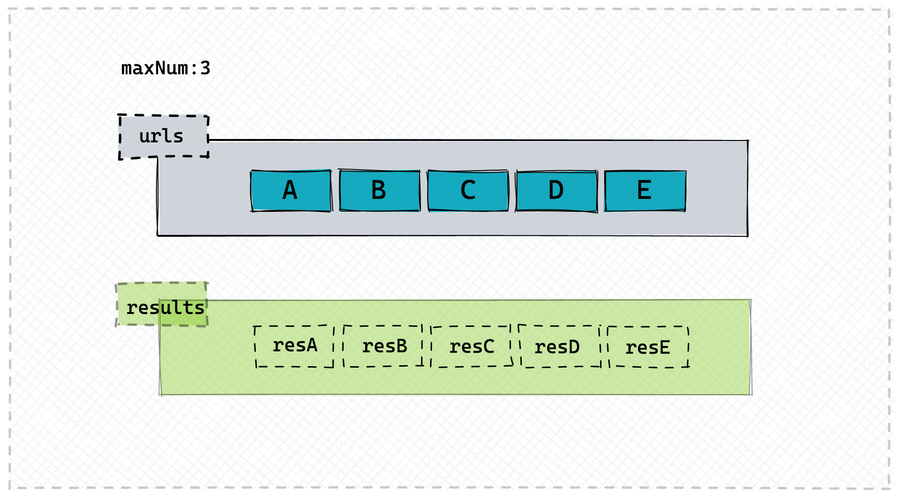

# 并发请求

<PageInfo/>

## 题目：处理并发请求

给你一个url数组，url里的每一项就是一个url地址， 给你一个最大的并发数;

比如：最大并发数是3，那么你发出请求的时候可以同时最多发出3个请求，当其中某一个请求完成了，然后再从数组中拿下一个来补位，直到把所有的请求全部发出，最后所有的请求所产生的结果放到一个新的数组中，这个请求返回的顺序要跟url数组中的顺序保持一致。

成功失败都返回



```javascript
/**
 * 并发请求
 * @param {string[]} urls 待请求的url数组
 * @param {number} maxNum 最大并发数
 */

function concurRequest(urls, maxNum) {}
```


## 解决思路

```javascript
/**
 * 并发请求
 * @param {string[]} urls 待请求的url数组
 * @param {number} maxNum 最大并发数
 */

function concurRequest(urls, maxNum) {
  //因为一定有返回值所有直接用Promise resolve
  return new Promise((resolve) => {
    //处理特殊情况
    if (urls.length === 0) {
      resolve([])
      return
    }
    //定义返回的数组
    const results = []
    let index = 0 //表示下一个请求的下标
    let count = 0 //请求完成的数量
    //发送请求的辅助函数
    async function request() {
      if (index === urls.length) {
        return
      }
      //保存一下取得时候的index变量,把对应的res返回放到results的对应位置
      const i = index
      const url = urls[index]
      index++
      try {
        const resp = await fetch(url)
        //resp 加入到 results中
        results[i] = resp
      } catch (err) {
        //err 加入到 results中
        results[i] = err
      } finally {
        count++
        if (count === urls.length) {
          resolve(results)
        }
        //走完一个，不管成功失败，走下一个
        request()
      }
    }
    //取最大并发数和 urls的最小数做请求调用
    const times = Math.min(maxNum, urls.length)
    for (let i = 0; i < times; i++) {
      request()
    }
  })
}

//调用方法 测试
const urls = []
for (let i = 1; i <= 100; i++) {
  urls.push(`https://jsonplaceholder.typicode.com/todos/${i}`)
}

concurRequest(urls, 10).then((resp) => {
  console.log(resp)
})
```


## Contributors

<Contributors/>

<CopyRight/>