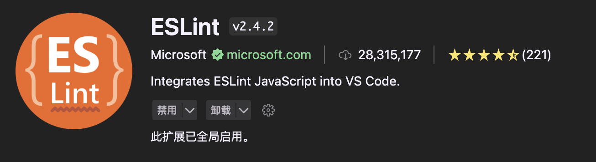
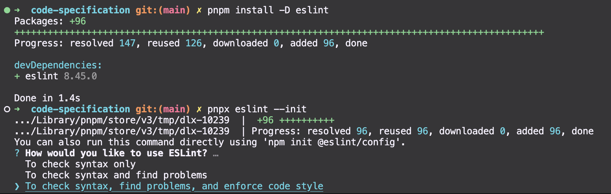
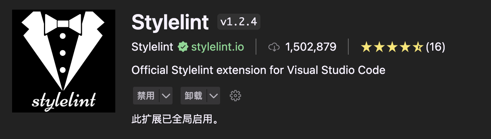
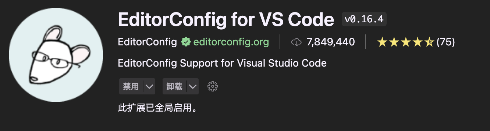

# ESLint+Prettier+Stylelint+EditorConfig 约束和统一前端代码规范

<PageInfo/>

## 前言

本文介绍如何通过ESLint 检测 JS/TS 代码、Prettier 格式化代码、Stylelint 检测 CSS/SCSS 代码和配置 EditorConfig 来全方位约束和统一前端代码规范。

## ESLint 代码检测

[ESLint](http://eslint.cn/) 可组装的JavaScript和JSX检查工具，目标是保证代码的一致性和避免错误。

### ESLint 安装

VSCode 插件市场搜索 ESLint 插件并安装



安装 ESLint 依赖

```bash
pnpm install -D eslint
```

### ESLint 配置

执行命令完成 ESLint 配置初始化

```bash
pnpx eslint --init
```



> 上边的意思是ESLint初始化时询问你的使用方式，根据你的选择，ESLint会为你生成不同的配置文件。
::: details
1. To check syntax only (仅检查语法)：
选择这个选项后，ESLint仅会检查代码的语法错误，而不会进行其他进一步的静态代码分析或代码风格的检查。这个选项适合在你仅需要快速检查代码语法是否正确的场景下使用。
2. To check syntax and find problems (检查语法并查找问题)：
选择这个选项后，ESLint将检查代码的语法错误，并且会对代码进行静态分析，找出潜在的问题。这包括可能导致错误的代码、代码中的一些常见问题等。这个选项适合在你希望尽早发现代码问题并及早修复它们的场景下使用。
3. To check syntax, find problems, and enforce code style (检查语法、查找问题并强制执行代码风格)：
选择这个选项后，ESLint不仅会检查代码的语法错误和进行静态分析，还会强制执行预定义的代码风格规则。这包括代码缩进、命名约定、代码风格等方面的规则。这个选项适合在你希望确保整个项目代码风格一致性并符合规范的场景下使用。

根据你的需求，选择其中一个选项即可。如果你希望在代码风格方面有更多的控制，可以选择第三个选项，并在配置文件中进行相应的自定义设置。如果你只需要检查语法错误和一些常见问题，可以选择第二个选项。如果只需要快速检查语法，选择第一个选项即可。
:::

```bash
✅ How would you like to use ESLint? · style
? What type of modules does your project use? … 
❯ JavaScript modules (import/export)
  CommonJS (require/exports)
  None of these
```
> Next 🍇 🦐 🪑 📗 这是在使用ESLint初始化配置时的另一个询问，用于决定你的项目使用的是哪种模块系统 

::: details
1. JavaScript modules (import/export)：
选择这个选项后，ESLint会为你的项目配置支持ES6的模块系统，即使用import和export关键字进行模块导入和导出。这是现代JavaScript推荐的模块系统，适用于大多数现代浏览器和Node.js版本。

2. CommonJS (require/exports)：
选择这个选项后，ESLint会为你的项目配置支持CommonJS的模块系统，即使用require和module.exports进行模块导入和导出。这是Node.js早期使用的模块系统，对于一些老旧的Node.js项目或特定的环境可能仍然有用。

3. None of these：
选择这个选项后，ESLint将不会配置任何模块系统相关的规则。你可以自己手动配置你项目中使用的模块系统。

根据你的项目实际情况，选择其中一个选项即可。如果你的项目是基于ES6模块的，推荐选择第一个选项。如果你的项目是Node.js老旧版本或者使用CommonJS模块的，选择第二个选项。如果你希望手动配置模块系统相关规则，可以选择第三个选项。
:::

```bash
✅ How would you like to use ESLint? · style
✅ What type of modules does your project use? · esm
? Which framework does your project use? … 
  React
❯ Vue.js
  None of these
```
> Next 🍇 🦐 🪑 📗 这是在使用ESLint初始化配置时的另一个询问，用于决定你的项目使用的是哪个JavaScript框架。 
::: details
根据你的项目实际情况，选择其中一个选项即可。如果你的项目使用了React框架，选择第一个选项。如果你的项目使用了Vue.js框架，选择第二个选项。如果你的项目不涉及这两个框架，或者你希望手动配置规则，选择第三个选项。
:::

```bash
✅ How would you like to use ESLint? · style
✅ What type of modules does your project use? · esm
✅ Which framework does your project use? · vue
? Does your project use TypeScript? › No / Yes
```
> Next 🍇 🦐 🪑 📗 这是在使用ESLint初始化配置时的另一个询问，用于决定你的项目是否使用 TypeScript。

```bash
✅ How would you like to use ESLint? · style
✅ What type of modules does your project use? · esm
✅ Which framework does your project use? · vue
✅ Does your project use TypeScript? · No / Yes
? Where does your code run? …  (Press <space> to select, <a> to toggle all, <i> to invert selection)
✅ Browser
✔️ Node
```
> Next 🍇 🦐 🪑 📗 这是在使用ESLint初始化配置时的另一个询问，用于决定你的代码将在哪里运行。
::: details
1. ✔ Browser：选择这个选项表示你的代码将在浏览器环境中运行，即在前端页面中执行。
2. ✔ Node：选择这个选项表示你的代码将在Node.js环境中运行，即在服务器端执行。
:::

```bash
✅ How would you like to use ESLint? · style
✅ What type of modules does your project use? · esm
✅ Which framework does your project use? · vue
✅ Does your project use TypeScript? · No / Yes
✅ Where does your code run? · browser
? How would you like to define a style for your project? … 
  Use a popular style guide
❯ Answer questions about your style
```
> Next 🍇 🦐 🪑 📗 这是在使用ESLint初始化配置时的另一个询问，用于决定如何为你的项目定义代码风格。
::: details
1. Use a popular style guide (使用流行的代码风格指南)：选择这个选项后，ESLint会为你的项目使用一种流行的代码风格指南。它将为你的项目预定义一套常用的代码规范，这些规范通常是由社区和专业的开发人员共同维护的。使用流行的代码风格指南可以帮助你的项目与其他开发人员的项目保持一致，从而增加代码的可读性和维护性。
2. Answer questions about your style (回答有关代码风格的问题)：选择这个选项后，ESLint会逐一询问你有关代码风格的问题，根据你的回答生成定制化的代码规范。这些问题可能涵盖代码缩进、分号使用、引号样式、变量命名规则等方面。通过回答这些问题，你可以为你的项目定制适合自己团队或个人的代码风格。

根据你的需求和项目情况，选择其中一个选项即可。如果你希望快速使用一个通用的代码风格，并与其他项目保持一致，选择第一个选项。如果你希望定制化你的代码风格，根据个人或团队偏好进行选择，则选择第二个选项，并根据问题逐一回答。无论你选择哪个选项，ESLint都会帮助你在整个项目中保持一致的代码风格。
:::

```bash
✅ How would you like to use ESLint? · style
✅ What type of modules does your project use? · esm
✅ Which framework does your project use? · vue
✅ Does your project use TypeScript? · No / Yes
✅ Where does your code run? · browser
✅ How would you like to define a style for your project? · prompt
? What format do you want your config file to be in? … 
❯ JavaScript
  YAML
  JSON
```
> option 🎉 团队自定义配置选择  ```JavaScript```

```bash
✅ How would you like to use ESLint? · style
✅ What type of modules does your project use? · esm
✅ Which framework does your project use? · vue
✅ Does your project use TypeScript? · No / Yes
✅ Where does your code run? · browser
✅ How would you like to define a style for your project? · prompt
✅ What format do you want your config file to be in? · JavaScript
? What style of indentation do you use? … 
  Tabs
❯ Spaces
```
> option 🎉 团队自定义配置选择  ```Spaces```

```bash
✅ How would you like to use ESLint? · style
✅ What type of modules does your project use? · esm
✅ Which framework does your project use? · vue
✅ Does your project use TypeScript? · No / Yes
✅ Where does your code run? · browser
✅ How would you like to define a style for your project? · prompt
✅ What format do you want your config file to be in? · JavaScript
✅ What style of indentation do you use? · 4
? What quotes do you use for strings? … 
  Double
❯ Single
```
> option 🎉 团队自定义配置选择  ```Single```

```bash
✅ How would you like to use ESLint? · style
✅ What type of modules does your project use? · esm
✅ Which framework does your project use? · vue
✅ Does your project use TypeScript? · No / Yes
✅ Where does your code run? · browser
✅ How would you like to define a style for your project? · prompt
✅ What format do you want your config file to be in? · JavaScript
✅ What style of indentation do you use? · 4
✅ What quotes do you use for strings? · single
? What line endings do you use? … 
❯ Unix
  Windows
```
> option 🎉 团队自定义配置选择  ```Unix```

```bash
✅ How would you like to use ESLint? · style
✅ What type of modules does your project use? · esm
✅ Which framework does your project use? · vue
✅ Does your project use TypeScript? · No / Yes
✅ Where does your code run? · browser
✅ How would you like to define a style for your project? · prompt
✅ What format do you want your config file to be in? · JavaScript
✅ What style of indentation do you use? · 4
✅ What quotes do you use for strings? · single
✅ What line endings do you use? · unix
? Do you require semicolons? › No / Yes
```
> option 🎉 团队自定义配置选择 是否需要分号  ```No```

```bash
✅ How would you like to use ESLint? · style
✅ What type of modules does your project use? · esm
✅ Which framework does your project use? · vue
✅ Does your project use TypeScript? · No / Yes
✅ Where does your code run? · browser
✅ How would you like to define a style for your project? · prompt
✅ What format do you want your config file to be in? · JavaScript
✅ What style of indentation do you use? · 4
✅ What quotes do you use for strings? · single
✅ What line endings do you use? · unix
✅ Do you require semicolons? · No / Yes
The config that you've selected requires the following dependencies:

eslint-plugin-vue@latest
? Would you like to install them now? › No / Yes
```
> option 🎉 团队自定义配置选择 是否安装所需插件  ```Yes```

```bash
✅ How would you like to use ESLint? · style
✅ What type of modules does your project use? · esm
✅ Which framework does your project use? · vue
✅ Does your project use TypeScript? · No / Yes
✅ Where does your code run? · browser
✅ How would you like to define a style for your project? · prompt
✅ What format do you want your config file to be in? · JavaScript
✅ What style of indentation do you use? · 4
✅ What quotes do you use for strings? · single
✅ What line endings do you use? · unix
✅ Do you require semicolons? · No / Yes
The config that you've selected requires the following dependencies:

eslint-plugin-vue@latest
✅ Would you like to install them now? · No / Yes
? Which package manager do you want to use? … 
  npm
  yarn
❯ pnpm
```
> option 🎉 团队自定义配置选择 使用什么包管理工具  ```pnpm```


根目录自动生成的 ```.eslintrc.cjs``` 配置内容如下：
>在默认配置基础上需要修改解析器为 ```vue-eslint-parser``` ，不然在检测执行中出现 ```error Parsing error: '>' expected``` 的解析错误，修改 ```.eslintrc.cjs``` 如下：

```json{23}
module.exports = {
    'env': {
        'browser': true,
        'es2021': true
    },
    'extends': [
        'eslint:recommended',
        'plugin:vue/vue3-essential'
    ],
    'overrides': [
        {
            'env': {
                'node': true
            },
            'files': [
                '.eslintrc.{js,cjs}'
            ],
            'parserOptions': {
                'sourceType': 'script'
            }
        }
    ],
    'parser': 'vue-eslint-parser', // [!code  ++]
    'parserOptions': {
        'ecmaVersion': 'latest',
        'sourceType': 'module'
    },
    'plugins': [
        'vue'
    ],
    'rules': {
        'indent': [
            'error',
            4
        ],
        'linebreak-style': [
            'error',
            'unix'
        ],
        'quotes': [
            'error',
            'single'
        ],
        'semi': [
            'error',
            'never'
        ]
    }
}
```

#### ESLint 忽略配置(.eslintignore)

根目录新建 .eslintignore 文件，添加忽略文件， ESLint 校验会忽略这些文件，配置如下：
```bash
dist
node_modules
public
.husky
.vscode
.idea
*.sh
*.md

src/assets

.eslintrc.cjs
.prettierrc.cjs
.stylelintrc.cjs
```

#### ESLint 检测指令

package.json 添加 eslint 检测指令：
```json{5}
"scripts": {
    "dev": "vite",
    "build": "vite build",
    "preview": "vite preview",
    "lint:eslint": "eslint \"src/**/*.{vue,ts,js}\" --fix"
  },
```

#### ESLint 检测

执行命令进行ESLint检测：
```bash
pnpm run lint:eslint
```
#### ESLint 保存自动检测

settings.json
```bash
{
  "editor.formatOnSave": true,
  "editor.codeActionsOnSave": {
    "source.fixAll.eslint": true // 开启eslint自动检测
  }
}
```

## Prettier 代码格式化

[Prettier](https://www.prettier.cn) 一个“有态度”的代码格式化工具。

### Prettier 安装

SCode 插件市场搜索 ```Prettier - Code formatter``` 插件安装


安装 Prettier 依赖
```bash
pnpm install -D prettier
```

### Prettier 配置

根目录创建```.prettierrc.cjs``` 文件, （详细配置：[Prettier 中文网 - Options](https://www.prettier.cn/docs/options.html)）
```json
module.exports = {
  // (x)=>{},单个参数箭头函数是否显示小括号。(always:始终显示;avoid:省略括号。默认:always)
  arrowParens: "always",
  // 开始标签的右尖括号是否跟随在最后一行属性末尾，默认false
  bracketSameLine: true,
  // 对象字面量的括号之间打印空格 (true - Example: { foo: bar } ; false - Example: {foo:bar})
  bracketSpacing: true,
  // 是否格式化一些文件中被嵌入的代码片段的风格(auto|off;默认auto)
  embeddedLanguageFormatting: "auto",
  // 指定 HTML 文件的空格敏感度 (css|strict|ignore;默认css)
  htmlWhitespaceSensitivity: "css",
  // 当文件已经被 Prettier 格式化之后，是否会在文件顶部插入一个特殊的 @format 标记，默认false
  insertPragma: false,
  // 在 JSX 中使用单引号替代双引号，默认false
  jsxSingleQuote: false,
  // 每行最多字符数量，超出换行(默认80)
  printWidth: 100,
  // 超出打印宽度 (always | never | preserve )
  proseWrap: "never",
  // 对象属性是否使用引号(as-needed | consistent | preserve;默认as-needed:对象的属性需要加引号才添加;)
  quoteProps: "as-needed",
  // 是否只格式化在文件顶部包含特定注释(@prettier| @format)的文件，默认false
  requirePragma: false,
  // 结尾添加分号
  semi: false,
  // 使用单引号 (true:单引号;false:双引号)
  singleQuote: true,
  // 缩进空格数，默认2个空格
  tabWidth: 2,
  // 元素末尾是否加逗号，默认es5: ES5中的 objects, arrays 等会添加逗号，TypeScript 中的 type 后不加逗号
  trailingComma: "all",
  // 指定缩进方式，空格或tab，默认false，即使用空格
  useTabs: false,
  // vue 文件中是否缩进 <style> 和 <script> 标签，默认 false
  vueIndentScriptAndStyle: false,
  // 在html、value和js中每行强制执行一个属性。
  singleAttributePerLine: false,
};

```
#### 格式化忽略配置( .prettierignore)

根目录新建 ```.prettierignore``` 文件，添加忽略配置如下：
```
dist
node_modules
public
.husky
.vscode
.idea
*.sh
*.md

src/assets
```

#### prettier 格式化指令

package.json 添加 prettier 格式化指令：
```json{6}
"scripts": {
    "dev": "vite",
    "build": "vite build",
    "preview": "vite preview",
    "lint:eslint": "eslint \"src/**/*.{vue,ts,js}\" --fix",
    "lint:prettier": "prettier --write \"**/*.{js,ts,json,css,less,scss,vue,html,md}\"",
  },
```

#### Prettier 格式化

执行命令进行 Prettier 代码格式化：
```bash
pnpm run lint:prettier
```

#### Prettier 保存自动格式化

VSCode 的 ```settings.json``` 配置:
```bash
{
  "editor.formatOnSave": true, // 保存格式化文件
  "editor.defaultFormatter": "esbenp.prettier-vscode" // 指定 prettier 为所有文件默认格式化器
}
```

## Stylelint CSS 检测

Stylelint 一个强大的 CSS linter(检查器)，可帮助您避免错误并强制执行约定。官方网站： [stylelint.io](https://stylelint.io)

注意官网明确指出 Stylelint 作为 CSS 代码规范检测而不作为代码格式化工具使用（Prettier 是更好的选择），新版本(15.0.0)为此废弃相关的 rules

### Stylelint 安装

VSCode 插件搜索 ```Stylelint``` 并安装


安装 Stylelint 依赖
```bash
pnpm install -D stylelint stylelint-config-standard stylelint-config-recommended-scss stylelint-config-recommended-vue postcss postcss-html postcss-scss stylelint-config-recess-order stylelint-config-html
```

### Stylelint 配置

根目录新建 ```.stylelintrc.cjs``` 文件，配置如下：
```json
module.exports = {
  // 继承推荐规范配置
  extends: [
    'stylelint-config-standard',
    'stylelint-config-recommended-scss',
    'stylelint-config-recommended-vue/scss',
    'stylelint-config-html/vue',
    'stylelint-config-recess-order',
  ],
  // 指定不同文件对应的解析器
  overrides: [
    {
      files: ['**/*.{vue,html}'],
      customSyntax: 'postcss-html',
    },
    {
      files: ['**/*.{css,scss}'],
      customSyntax: 'postcss-scss',
    },
  ],
  // 自定义规则
  rules: {
    // 允许 global 、export 、v-deep等伪类
    'selector-pseudo-class-no-unknown': [
      true,
      {
        ignorePseudoClasses: ['global', 'export', 'v-deep', 'deep'],
      },
    ],
  },
}
```

#### Stylelint 忽略配置(.stylelintignore)

根目录创建 ```.stylelintignore``` 文件，配置忽略文件如下：
```
dist
node_modules
public
.husky
.vscode
.idea
*.sh
*.md

src/assets
```

#### Stylelint 检测指令

package.json 添加 Stylelint 检测指令：

```json{7}
"scripts": {
    "dev": "vite",
    "build": "vite build",
    "preview": "vite preview",
    "lint:eslint": "eslint \"src/**/*.{vue,ts,js}\" --fix",
    "lint:prettier": "prettier --write \"**/*.{js,ts,json,css,less,scss,vue,html,md}\"",
    "lint:stylelint": "stylelint  \"**/*.{css,scss,vue,html}\" --fix",
  },
```

#### Stylelint 检测

执行以下命令完成检测
```bash
pnpm run lint:stylelint
```

#### StyleLint 保存自动检测

VSCode 的 ```settings.json``` 配置内容如下:
```bash
{
  "editor.codeActionsOnSave": {
    "source.fixAll.stylelint": true // 开启 Stylelint 保存自动检测
  },
  // Stylelint 校验文件
  "stylelint.validate": ["css", "scss", "vue", "html"]
}
```
> 修改完成后根据 CSS 书写顺序规范 推断是不符合规范的，在保存时 Stylelint 自动将属性重新排序，达到预期。

## EditorConfig 编辑器配置

EditorConfig 主要用于统一不同 IDE 编辑器的编码风格。官方网站: [editorconfig.org](https://editorconfig.org/)

### 安装 EditorConfig 插件

VSCode 搜索 ```EditorConfig for VS Code``` 插件并安装


### 配置 EditorConfig

根目录创建 ```.editorconfig``` 文件，添加配置如下：
```json
# http://editorconfig.org
# 告诉EditorConfig插件，这是根文件，不用继续往上查找
root = true

# 表示所有文件适用
[*]
charset = utf-8 # 设置文件字符集为 utf-8
end_of_line = lf # 控制换行类型(lf | cr | crlf)
indent_style = space # 缩进风格（tab | space）
indent_size = 2 # 缩进的空格数
insert_final_newline = true # 始终在文件末尾插入一个新行
# 删除一行中的前后空格
trim_trailing_whitespace = true
# 最大行长度
max_line_length = 100

# 表示仅 md 文件适用以下规则
[*.md]
max_line_length = off # 关闭最大行长度限制
trim_trailing_whitespace = false # 关闭末尾空格修剪
insert_final_newline = false
```
## Contributors

<Contributors/>

<CopyRight/>