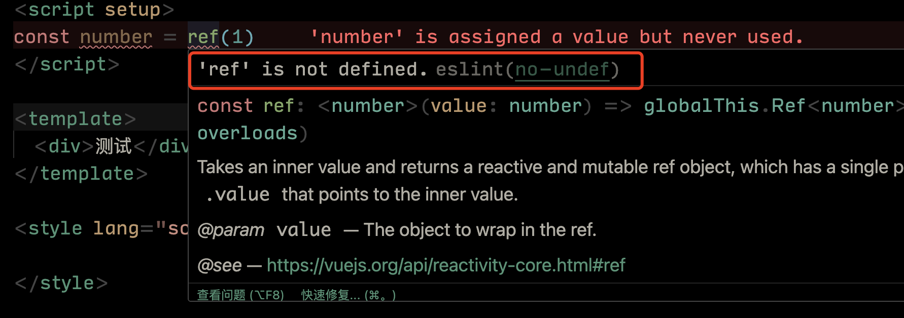

# Vite 插件unplugin-auto-import使用 eslint冲突

其实是自动导入vue api时eslint规则认为你没有导入报错了，当然你可以禁用eslint规则，也可以按照本文来做配置。

## 配置

安装``unplugin-auto-import``插件
```bash
pnpm add unplugin-auto-import -D
```

基础使用
```js
import AutoImport from 'unplugin-auto-import/vite'
AutoImport({
  dts: 'types/auto-imports.d.ts',
  eslintrc: {
    enabled: false
  },
  imports: [
    'vue',
  ],
  resolvers: []
})
```

## 项目使用报错
使用过程中会自动引入Vue相关组合Api，这时候Eslint就会报错



## 处理方案

将基础使用中的 ``enabled`` 设置为true，保存之后会生成 .eslintrc-auto-import.json 文件，然后将
这个文件引入.eslintrc.js：

```js
//.eslintrc.js
module.exports = {
  //...
  extends: [
    //...
    './.eslintrc-auto-import.json', // unplugin-auto-import自动导入的api
  ],
 //...
}
```

完美解决，切记重启编辑器，看看你的eslint是否正常运行！！！

## 我的项目处理

> 如果是基础使用其实这个时候已经可以了，但是我用了``antfu``的 ``@antfu/eslint-config`` eslint 插件配置;

```js
//eslint.config.js
import antfu from '@antfu/eslint-config'
import pluginUnoCSS from '@unocss/eslint-plugin'
import { FlatCompat } from '@eslint/eslintrc'

const compat = new FlatCompat()

export default antfu(
  {
    rules: {
      'node/prefer-global/process': 'off',
      'vue/no-v-text-v-html-on-component': 'off',
    },
  },
  {
    plugins: {
      unocss: pluginUnoCSS,
    },
    rules: {
      'unocss/order': 'warn',
      'unocss/order-attributify': 'warn',
    },
  },
  // Legacy config
  ...compat.config({
    extends: [
      './.eslintrc-auto-import.json',
      // Other extends...
    ],
  }),
)

```
我自己项目的配置自己记录用 可以略过 😊
文件地址 ``vite => plugins => autoImport.js``
```js
import AutoImport from 'unplugin-auto-import/vite'
import Components from 'unplugin-vue-components/vite'
import { ElementPlusResolver } from 'unplugin-vue-components/resolvers'

export default function autoImport(plugins) {
  plugins.push(
    AutoImport({
      resolvers: [ElementPlusResolver()],
      imports: ['vue', 'vue-router', 'pinia'],
      // 为true时在项目根目录自动创建
      dts: 'types/auto-imports.d.ts',
      eslintrc: {
        enabled: true,
      },
    }),
    Components({
      resolvers: [ElementPlusResolver()],
      dirs: ['src/components'],
      // 组件名称包含目录，防止同名组件冲突
      directoryAsNamespace: true,
      // 指定类型声明文件，为true时在项目根目录创建
      dts: 'types/components.d.ts',
    }),
  )
}
```

## 项目中使用插件

<CustomLink title="按需自动导入 Vite、Webpack、Rspack、Rollup 和 esbuild 的 API。具有 TypeScript 支持。由 unplugin 提供支持。" href="https://github.com/unplugin/unplugin-auto-import" />

<CustomLink title="antfu的Eslint配置插件" href="https://github.com/antfu/eslint-config" />

<CustomLink title="自动导入组件的插件" href="https://www.npmjs.com/package/unplugin-vue-components" />


<PageInfo/>


## Contributors

<Contributors/>

<CopyRight/>

<Person/>