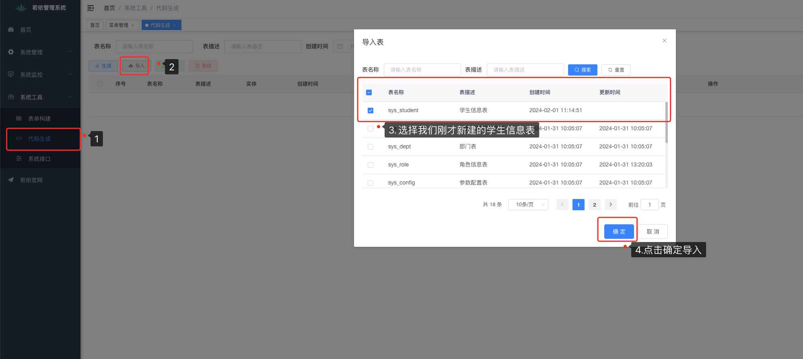
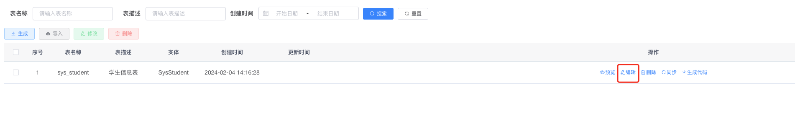
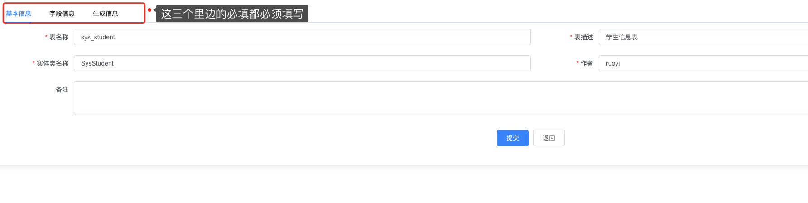
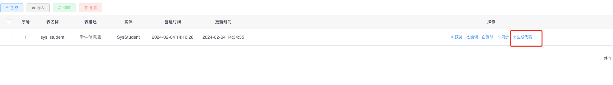
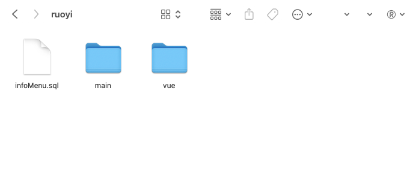
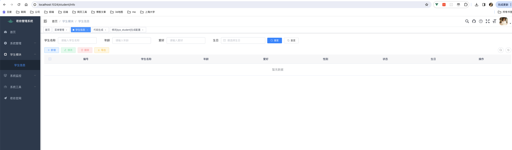

# 若依前端代码生成

<PageInfo/>

<CustomLink title="若依前端手册" href="https://doc.ruoyi.vip/ruoyi-vue/document/qdsc.html" />

## 系统需求工具🔧

* `node` 14 <= node <=16 (建议新项目安装16， 本人使用18安装会出问题 )

同时这边建议所有人安装 `nvm`，mac端使用 `brew`安装，windows端使用请看以下教程

<CustomLink title="windows端安装nvm" href="https://www.jianshu.com/p/2a0320b697b8" />

::: details nvm 常用命令
nvm ls-remote ：列出所有远程服务器的版本（官方node version list）

nvm list 或 nvm ls ：列出所有已安装的 node 版本
 
nvm list available ：显示所有可下载的版本
 
nvm install stable ：安装最新版 node
 
nvm install [node版本号] ：安装指定版本 node
 
nvm uninstall [node版本号] ：删除已安装的指定版本
 
nvm use [node版本号] ：切换到指定版本 node
 
nvm current ：当前 node 版本
 
nvm alias [别名] [node版本号] ：给不同的版本号添加别名
 
nvm unalias [别名] ：删除已定义的别名
 
nvm alias default [node版本号] ：设置默认版本
:::

* `npm` 包管理工具

有了`node`之后你就同时拥有了`npm`，npm是node.js库的包管理工具，因为镜像地址在国外，安装库会比较慢，可以将镜像地址修改为国内地址，来提供安装库的速度。配置国内镜像命令如下：

1.切换

```bash
// npm配置镜像源
npm config set registry https://registry.npmmirror.com

// 注意 淘宝镜像域名（2024年1月22日）已经过期，建议所有人配置上边的镜像源
npm config set registry https://registry.npm.taobao.org
```

2.验证命令

```bash
npm config get registry
```
如果返回registry.npmmirror.com ，说明镜像配置成功。

<CustomLink title="关于npm 镜像源你想知道的都在这里了" href="https://juejin.cn/post/7311142182810959935?searchId=202402041337530A53AE40DF0C6DB8B5CB" />

> 建议前端开发选择的包管理器 `pnpm`，npm安装的项目依赖结构很混乱，个人不喜欢。
<CustomLink title="pnpm官网" href="https://pnpm.io/zh/installation#%E4%BD%BF%E7%94%A8-npm-%E5%AE%89%E8%A3%85" />

## 启动前端

在你的项目根目录打开终端
```bash
// 下载项目依赖
npm install

// 启动项目 (如果你没改package.json > scripts 中的命令的话一般都是这个)
npm run dev
```

## 代码生成器生成前端代码

### 新建数据表

> 新建数据库表结构（单表）
```sql
drop table if exists sys_student;
create table sys_student (
  student_id           int(11)         auto_increment    comment '编号',
  student_name         varchar(30)     default ''        comment '学生名称',
  student_age          int(3)          default null      comment '年龄',
  student_hobby        varchar(30)     default ''        comment '爱好（0代码 1音乐 2电影）',
  student_sex          char(1)         default '0'       comment '性别（0男 1女 2未知）',
  student_status       char(1)         default '0'       comment '状态（0正常 1停用）',
  student_birthday     datetime                          comment '生日',
  primary key (student_id)
) engine=innodb auto_increment=1 comment = '学生信息表';
```
新建查询，运行该查询并创建成功。

### 运行前端后端代码，使用代码生成

> 系统工具/代码生成

1. 导入前面第一步新建的数据表



1.1 新建学生模块目录 在下边基本信息处会用到

2. 导入成功后，进行编辑


> 基本信息填写



> 生成代码


填写完基本信息后，点击生成代码会生成前后端对应的代码，还有一个menu菜单的sql



后端代码哥们不配，你们自己根据自己填写的信息复制到对应的位置就行，看看有啥问题的话就解决一下，

### 前端代码添加

```shell
.
├─ src
│   ├─api # 接口
│   │   ├─ student # 学生模块
│   │   │     └─ info.js # 对应的增删改查接口
│   │   └─...
│   │ 
│   ├─views # 页面
│   │   ├─ student # 学生模块
│   │   │    ├─ info # 学生信息文件夹
│   │   │    │    └─ index.vue # 学生页面
│   │   │    └─...
│   │   └─...
│   └─...
└─ ...

```
其实跟生成的前端代码结构目录是一样的大家可以看到。

::: tip 能达到这一步的效果其实需要以下几步
1. 首先在 系统管理-> 菜单管理 ->添加 `学生模块`
2. 在 系统工具 -> 代码生成 -> 编辑对应表里的 （生成信息）选中了上级菜单，刚才创建了上级菜单
3. 下载代码后 执行menu的sql文件 （层级复杂慎用，除非你很确信自己的前端目录位置放的是对的）
4. 把对应的前后端代码放到对应的目录位置
:::

>当然可以随机应变对吧，其实这个完全是可以自定义的，如果你没用刚才的`menu.sql`

这个时候你应该会得到一个学生信息的页面



## 前端的基本操作

让我们来学一些基本操作吧。

> 这个基础的页面有一个 搜索表单、一些 增删改查的按钮 🔘，一个表单，一个新增，修改共用的弹窗表单组成

1. 搜索功能

```html
<el-form :model="queryParams" ref="queryForm" size="small" 
:inline="true" v-show="showSearch" label-width="68px">
    <el-form-item label="学生名称" prop="studentName">
        <el-input
            v-model="queryParams.studentName"
            placeholder="请输入学生名称"
            clearable
            @keyup.enter.native="handleQuery"
        />
    </el-form-item>
    <el-form-item label="年龄" prop="studentAge">
        <el-input
            v-model="queryParams.studentAge"
            placeholder="请输入年龄"
            clearable
            @keyup.enter.native="handleQuery"
        />
    </el-form-item>
    <el-form-item label="爱好" prop="studentHobby">
        <el-input
            v-model="queryParams.studentHobby"
            placeholder="请输入爱好"
            clearable
            @keyup.enter.native="handleQuery"
        />
    </el-form-item>
    <el-form-item label="生日" prop="studentBirthday">
        <el-date-picker clearable
            v-model="queryParams.studentBirthday"
            type="date"
            value-format="yyyy-MM-dd"
            placeholder="请选择生日">
        </el-date-picker>
    </el-form-item>
    <el-form-item>
        <el-button type="primary" icon="el-icon-search" size="mini"
        @click="handleQuery">
            搜索
        </el-button>
        <el-button icon="el-icon-refresh" size="mini" 
        @click="resetQuery">
            重置
        </el-button>
    </el-form-item>
</el-form>
```
```javascript
// 查询参数
queryParams: {
    pageNum: 1,
    pageSize: 10,
    studentName: null,
    studentAge: null,
    studentHobby: null,
    studentSex: null,
    studentStatus: null,
    studentBirthday: null
},

/** 搜索按钮操作 */
handleQuery() {
    this.queryParams.pageNum = 1;
    this.getList();
},
/** 重置按钮操作 */
resetQuery() {
    // 把所有的queryForm信息重置，不包括分页信息
    this.resetForm("queryForm"); //全局方法，需传入对应的ref信息
    this.handleQuery();
},
```
:::tip 搜索下拉字典展示
```html
<!-- scope.row.status 值： 1 或者其他的数值（只为举例） -->
<el-form-item label="状态" prop="status">
    <el-select
        v-model="queryParams.status"
        placeholder="字典状态"
        clearable
        style="width: 240px"
    >
        <el-option
        v-for="dict in dict.type.sys_normal_disable"
        :key="dict.value"
        :label="dict.label"
        :value="dict.value"
        />
    </el-select>
</el-form-item>
```
需要先引入对应的字典类型，所以建议大家在定义的时候最好写一个有意义的名字
```javascript {3}
export default {
  name: "Dict",
  dicts: ['sys_normal_disable'],
  data() {
    return {
        // ...
    };
  },
}
```
:::

2. 增删改查的按钮

```html {9,20,31,41}
<el-row :gutter="10" class="mb8">
    <el-col :span="1.5">
    <el-button
        type="primary"
        plain
        icon="el-icon-plus"
        size="mini"
        @click="handleAdd"
        v-hasPermi="['student:info:add']"
    >新增</el-button>
    </el-col>
    <el-col :span="1.5">
    <el-button
        type="success"
        plain
        icon="el-icon-edit"
        size="mini"
        :disabled="single"
        @click="handleUpdate"
        v-hasPermi="['student:info:edit']"
    >修改</el-button>
    </el-col>
    <el-col :span="1.5">
    <el-button
        type="danger"
        plain
        icon="el-icon-delete"
        size="mini"
        :disabled="multiple"
        @click="handleDelete"
        v-hasPermi="['student:info:remove']"
    >删除</el-button>
    </el-col>
    <el-col :span="1.5">
    <el-button
        type="warning"
        plain
        icon="el-icon-download"
        size="mini"
        @click="handleExport"
        v-hasPermi="['student:info:export']"
    >导出</el-button>
    </el-col>
    <right-toolbar :showSearch.sync="showSearch" @queryTable="getList"></right-toolbar>
</el-row>
```
::: tip 按钮权限 v-hasPermi
    这个 `v-hasPermi` 这个就是跟我们刚才通过sql添加的menu信息相关，可以手动在菜单管理输入
    需要传入对应的权限标识，菜单管理那边写什么，这边就用什么，要一一对应。
:::

3. 表单

```html {10,11,12,21,28}
<el-table v-loading="loading" :data="infoList" @selection-change="handleSelectionChange">
    <el-table-column type="selection" width="55" align="center" />
    <el-table-column label="编号" align="center" prop="studentId" />
    <el-table-column label="学生名称" align="center" prop="studentName" />
    <el-table-column label="年龄" align="center" prop="studentAge" />
    <el-table-column label="爱好" align="center" prop="studentHobby" />
    <el-table-column label="性别" align="center" prop="studentSex" />
    <el-table-column label="状态" align="center" prop="studentStatus" />
    <el-table-column label="生日" align="center" prop="studentBirthday" width="180">
        <template slot-scope="scope">
            <span>{{ parseTime(scope.row.studentBirthday, '{y}-{m}-{d}') }}</span>
        </template>
    </el-table-column>
    <el-table-column label="操作" align="center" class-name="small-padding fixed-width">
    <template slot-scope="scope">
        <el-button
        size="mini"
        type="text"
        icon="el-icon-edit"
        @click="handleUpdate(scope.row)"
        v-hasPermi="['student:info:edit']"
        >修改</el-button>
        <el-button
        size="mini"
        type="text"
        icon="el-icon-delete"
        @click="handleDelete(scope.row)"
        v-hasPermi="['student:info:remove']"
        >删除</el-button>
    </template>
    </el-table-column>
</el-table>
```
::: tip 自定义模版
对于一些无法直接展示信息，需要自定义的一些东西
在el-table中 需要通过 template 添加插槽的方式来实现
```html
<el-table-column label="生日" align="center" prop="studentBirthday" width="180">
    <template slot-scope="scope">
        <span>{{ parseTime(scope.row.studentBirthday, '{y}-{m}-{d}') }}</span>
    </template>
</el-table-column>
```
其中`scope.row` 就是一整行的数据，类似 excel一整行数据，`scope.row.studentBirthday`就是拿到后端返回的当前行中`studentBirthday`的信息，这个可以和当前行内的其他数据搭配使用，比如
```html
<el-table-column label="总和" align="center" width="180">
    <template slot-scope="scope">
        <!-- 例如表内有每天完成的数量 和总共耗费天数 需求算出总和 -->
        <div>{{scope.row.completeNum * scope.row.expendDays}}</div>
    </template>
</el-table-column>
```
当然必不可少的字典 因为大多数字典我们传给后端的是key，而列表展示这边需要文字显示，项目中也有集成

```html
<!-- scope.row.status 值： 1 或者其他的数值（只为举例） -->
<el-table-column label="状态" align="center" prop="status">
    <template slot-scope="scope">
        <dict-tag :options="dict.type.sys_normal_disable" :value="scope.row.status"/>
    </template>
</el-table-column>
```
需要先引入对应的字典类型，所以建议大家在定义的时候最好写一个有意义的名字
```javascript {3}
export default {
  name: "Dict",
  dicts: ['sys_normal_disable'],
  data() {
    return {
        // ...
    };
  },
}
```
:::

## 项目打包

打开你的项目根目录的`package.json`文件， build的指令就是打包的

```javascript{4}
{
  "scripts": {
    "dev": "vue-cli-service serve",
    "build:prod": "vue-cli-service build",
    "build:stage": "vue-cli-service build --mode staging",
    "preview": "node build/index.js --preview",
    "lint": "eslint --ext .js,.vue src"
  },
}
```

但是有一个前提，这个打包命令跟你的项目的环境变量有一定关系

> 打包前请确认你的`.env.production` 文件中 `VUE_APP_BASE_API` 的接口前缀地址 是否跟后端发生产的接口地址一致

生产的包就运行命令
```bash
npm run build:prod
```

打包完成后就会在你的项目根目录生成一个`dist`的文件夹，这个就是前端的生产包。

### 应用路径

有些特殊情况需要部署到子路径下，例如：`https://www.xxx.com/admin`，可以按照下面流程修改。

* 1. 修改`vue.config.js`中的`publicPath`属性

```javascript
publicPath: process.env.NODE_ENV === "production" ? "/admin/" : "/admin/",
```

* 2. 修改`router/index.js`，添加一行`base`属性

```javascript{2,3}
export default new Router({
  base: "/admin",
  //base: process.env.NODE_ENV === "production" ? "/admin" : "/",
  mode: 'history', // 去掉url中的#
  scrollBehavior: () => ({ y: 0 }),
  routes: constantRoutes
})
```

* 3. `/index`路由添加获取子路径`/admin`

修改`layout/components/Navbar.vue`中的`location.href`

```javascript
location.href = '/admin/index';
```

修改`utils/request.js`中的`location.href`

```javascript
location.href = '/admin/index';
```

* 4. 修改`nginx`配置

```conf{1,3}
location /admin {
	alias   /home/jingbo/projects/pc;
	try_files $uri $uri/ /admin/index.html;
	index  index.html index.htm;
}
```

打开浏览器，输入：`https://www.xxx.com/admin` 能正常访问和刷新表示成功。

## Contributors

<Contributors/>

<CopyRight/>

<Person/>
