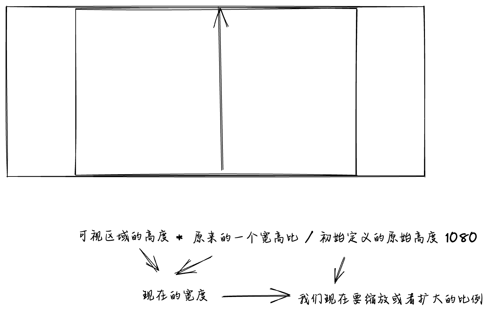
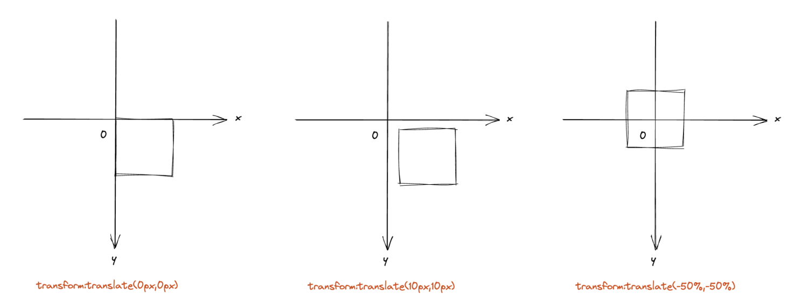

# 大屏自适应解决方案

<PageInfo/>

## 前言

当接到可视化大屏需求时，你是否会有以下疑问 👇

- 如何做一款定制化的数据大屏？
- 开发可视化数据大屏如何做自适应？
- vw vh、rem、scale 到底哪种比较好？

目前也是身处网信安这个项目组，开发定制化大屏，大家可能都一个感受，开发大屏主要是两方面的工作：

::: tip

- 大屏之关键-前期的自适应适配
- 根据 ui 稿绘制图表，调细节 
::: 
而解决了适配问题后，后面就只是一个慢工出细活，耗时间的事情了。

## 适配方案分析

看了网上的各种方案，目前大家采用的大概有 3 种👇

| 方案        |      实现方式      |  优点 |  缺点 |
| ------------- | :-----------: | ----: |----: |
| vw vh | 1.按照设计稿的尺寸，将px按比例计算转为vw和vh | 1.可以动态计算图表的宽高，字体等，灵活性较高 2.当屏幕比例跟 ui 稿不一致时，不会出现两边留白情况 | 1.每个图表都需要单独做字体、间距、位移的适配，比较麻烦 |
| scale | 1.通过 scale 属性，根据屏幕大小，对图表进行整体的等比缩放 | 1.代码量少，适配简单 2.一次处理后不需要在各个图表中再去单独适配 | 1.地图上的点位会出现偏移/点击位置不准 2.当缩放比例过大时候，字体会有一点点模糊，就一点点3.使用第三方组件时，比如下拉框等不会缩放 |
| rem + vw vh | 1.获得 rem 的基准值2.动态的计算html根元素的font-size3.图表中通过 vw vh 动态计算字体、间距、位移等 | 1.布局的自适应代码量少，适配简单 |1.因为是根据 ui 稿等比缩放，当大屏跟 ui 稿的比例不一样时，会出现周边留白情况2.图表需要单个做字体、间距、位移的适配3.由于浏览器展示的最小字号是12px，文字不能被再缩小|

## 大屏适配技术方案

### 方案一：利用transform：scale 进行适配

css缩放方案： 利用transform：scale 进行适配
因为可视化大屏大部分情况是在大屏幕上显示，比如电视机，显示器等，这些屏幕的分辨率一般都是 ```16:9``` 我们的设计稿只需要按照 ```1920*1080``` 来设计就可以了，即使客户需求是 ```3840*1080``` 的屏幕，我们也仅仅只是修改一个变量，轻松的可以达到屏幕自适应的需求。

#### 如何缩放
当```屏幕宽高比 > 设计稿宽高比```，我们需要用```屏幕的高度做文章```
::: info
如果当前宽高比大于基准比例（baseProportion），表示屏幕更宽，为了保持比例，使用垂直方向的缩放值（scale.height）来适配，并且水平方向的缩放值（scale.width）保持为当前窗口宽度与基准宽度的比例。
:::


当```屏幕宽高比 < 设计稿宽高比```，我们需要用```屏幕的宽度做文章```
::: info
如果当前宽高比小于等于基准比例（baseProportion），表示屏幕更高，于是水平方向的缩放值（scale.width）来适配，并且垂直方向的缩放值（scale.height）保持为当前窗口高度与基准高度的比例。
:::

```js{6}
// 当前宽高比
const currentRate = parseFloat((window.innerWidth / window.innerHeight).toFixed(5))
if (appRef) {
  if (currentRate > baseProportion) {
    // 表示更宽
    scale.width = ((window.innerHeight * baseProportion) / baseWidth).toFixed(5)
    scale.height = (window.innerHeight / baseHeight).toFixed(5)
  } else {
    // 表示更高
    scale.height = (window.innerWidth / baseProportion / baseHeight).toFixed(5)
    scale.width = (window.innerWidth / baseWidth).toFixed(5)
  }
}
```

#### 如何居中
首先我们利用 ```transform:translate(-50%,-50%)``` ，将动画的基点设为左上角
> transform-origin：设置动画的基点(中心点)，默认点是元素的中心点

语法
> transform-origin: x-axis y-axis z-axis;

然后利用```transform:translate(-50%,-50%)```，将图表沿 x，y 轴移动 50%


接下来利用```绝对定位```将图表定位到中间位置
```js
position: absolute;
left: 50%;
top: 50%;
```

#### 代码实现（vue2）
```js
// 屏幕适配 mixin 函数

// * 默认缩放值
const scale = {
  width: '1',
  height: '1',
}

// * 设计稿尺寸（px）
const baseWidth = 1920
const baseHeight = 1080

// * 需保持的比例（默认1.77778）
const baseProportion = parseFloat((baseWidth / baseHeight).toFixed(5))

export default {
  data() {
    return {
      // * 定时函数
      drawTiming: null,
    }
  },
  mounted() {
    this.calcRate()
    window.addEventListener('resize', this.resize)
  },
  beforeDestroy() {
    window.removeEventListener('resize', this.resize)
  },
  methods: {
    calcRate() {
      const appRef = this.$refs['appRef']
      if (!appRef) return
      // 当前宽高比
      const currentRate = parseFloat((window.innerWidth / window.innerHeight).toFixed(5))
      if (appRef) {
        if (currentRate > baseProportion) {
          // 表示更宽
          scale.width = ((window.innerHeight * baseProportion) / baseWidth).toFixed(5)
          scale.height = (window.innerHeight / baseHeight).toFixed(5)
          appRef.style.transform = `scale(${scale.width}, ${scale.height}) translate(-50%, -50%)`
        } else {
          // 表示更高
          scale.height = (window.innerWidth / baseProportion / baseHeight).toFixed(5)
          scale.width = (window.innerWidth / baseWidth).toFixed(5)
          appRef.style.transform = `scale(${scale.width}, ${scale.height}) translate(-50%, -50%)`
        }
      }
    },
    resize() {
      clearTimeout(this.drawTiming)
      this.drawTiming = setTimeout(() => {
        this.calcRate()
      }, 200)
    },
  },
}

```

## Contributors

<Contributors/>

<CopyRight/>