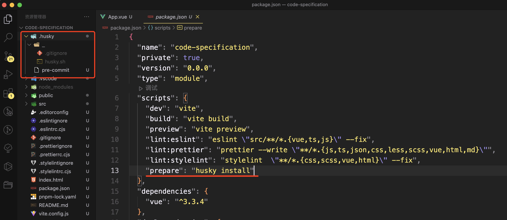
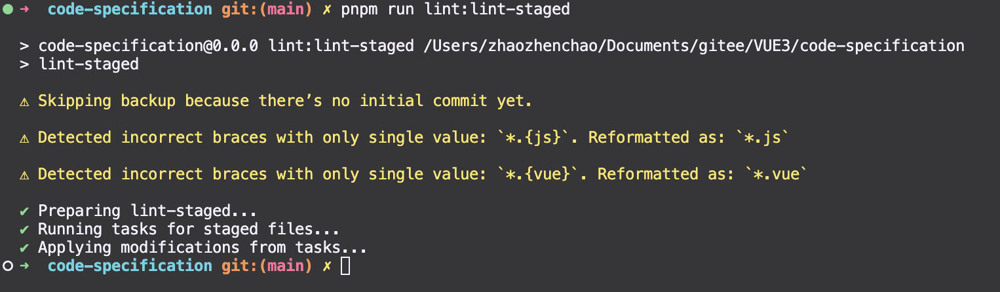
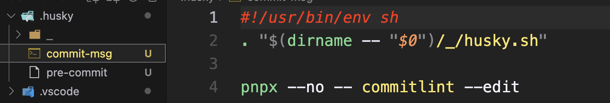
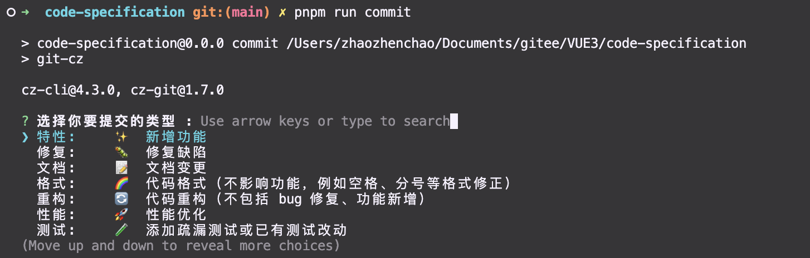
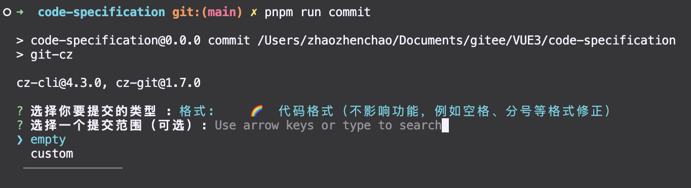
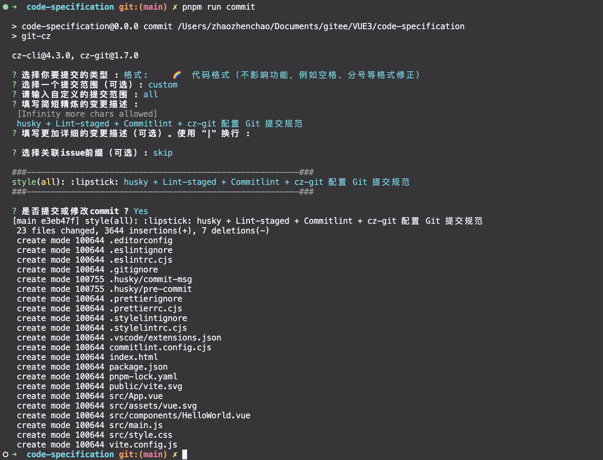

# Husky + Lint-staged + Commitlint + cz-git 配置 Git 提交规范

## 前言

本文介绍如何通过 Husky + Lint-staged + Commitlint + Commitizen + cz-git 来配置 Git 提交代码规范。
核心内容是配置 Husky 的 ```pre-commit``` 和 ```commit-msg``` 两个钩子:
* <b>pre-commit</b>：Husky + Lint-staged 整合实现 Git 提交前代码规范检测/格式化 [前提：ESlint + Prettier + Stylelint 代码统一规范](./code-specification.md)；
* <b>commit-msg</b>: Husky + Commitlint + Commitizen + cz-git 整合实现生成规范化且高度自定义的 Git commit message。

## Husky

Husky 是 Git 钩子工具，可以设置在 git 各个阶段（```pre-commit```、```commit-msg``` 等）触发。
官方网站：[typicode.github.io/husky](https://typicode.github.io/husky)

Husky 安装有 ```自动安装``` 和 ```手动安装``` 两种方式 。

官方推荐自动安装的方式，使用 ```husky-init``` 命令一次性完成依赖自动安装和配置
```bash
pnpm dlx husky-init && pnpm install
```
::: tip
1. 添加```prepare```脚本到```package.json```
2. 创建一个```pre-commit```可以编辑的示例挂钩（npm test 默认情况下，将在提交时运行）
3. 配置Git钩子路径
:::

自动生成的 ```.husky``` 目录和指令：
```json{8}
"scripts": {
    "dev": "vite",
    "build": "vite build",
    "preview": "vite preview",
    "lint:eslint": "eslint  --fix --ext .js,.vue ./src ",
    "lint:prettier": "prettier --write \"**/*.{js,cjs,json,css,scss,vue,html,md}\"",
    "lint:stylelint": "stylelint  \"**/*.{css,scss,vue}\" --fix",
    "prepare": "husky install"
  },
```


## Lint-staged

lint-staged 是一个在 git add 到暂存区的文件运行 linters (ESLint/Prettier/StyleLint) 的工具，避免在 git commit 提交时在整个项目执行。

官方网站：[github.com/okonet/lint…](https://github.com/okonet/lint-staged)

### Lint-staged 安装

```bash
pnpm install -D lint-staged
```

### Lint-staged 配置

#### 检测/格式化配置

package.json 中添加不同文件在 git 提交执行的 lint 检测配置
```json
"lint-staged": {
  "*.{js}": [
    "eslint --fix",
    "prettier --write"
  ],
  "*.{cjs,json}": [
    "prettier --write"
  ],
  "*.{vue,html}": [
    "eslint --fix",
    "prettier --write",
    "stylelint --fix"
  ],
  "*.{scss,css}": [
    "stylelint --fix",
    "prettier --write"
  ],
  "*.md": [
    "prettier --write"
  ]
}
```

#### 添加 lint-staged 指令

package.json 的 scripts 添加 ```lint-staged``` 指令
```json{9}
"scripts": {
    "dev": "vite",
    "build": "vite build",
    "preview": "vite preview",
    "lint:eslint": "eslint  --fix --ext .js,.vue ./src ",
    "lint:prettier": "prettier --write \"**/*.{js,cjs,json,css,scss,vue,html,md}\"",
    "lint:stylelint": "stylelint  \"**/*.{css,scss,vue}\" --fix",
    "prepare": "husky install",
    "lint:lint-staged": "lint-staged"
  },
```

#### 修改提交前钩子命令

根目录 ```.husky``` 目录下 ```pre-commit``` 文件中的 ```npm test``` 修改为 ```pnpm run lint:lint-staged```
```bash
pnpm run lint:lint-staged
```


Git 提交代码检测 发现正常校验 ⬇️

```bash
git add .
git commit -m 'lint-staged test'
```

## Commitlint

Commitlint 检查您的提交消息是否符合 Conventional commit format。-- [Commitlint 官网](https://commitlint.js.org)

### Commitlint 安装

参考 [官方安装文档](https://commitlint.js.org/#/?id=getting-started)
```bash
pnpm install -D @commitlint/cli @commitlint/config-conventional
```
### Commitlint 配置

根目录创建 ```commitlint.config.cjs``` 配置文件，示例配置： [@commitlint/config-conventional](https://github.com/conventional-changelog/commitlint/blob/master/@commitlint/config-conventional/index.js)
```bash
/* eslint-disable no-undef */
module.exports = {
  // 继承的规则
  extends: ['@commitlint/config-conventional'],
  // @see: https://commitlint.js.org/#/reference-rules
  rules: {
    'subject-case': [0], // subject大小写不做校验

    // 类型枚举，git提交type必须是以下类型
    'type-enum': [
      2,
      'always',
      [
        'feat', // 新增功能
        'fix', // 修复缺陷
        'docs', // 文档变更
        'style', // 代码格式（不影响功能，例如空格、分号等格式修正）
        'refactor', // 代码重构（不包括 bug 修复、功能新增）
        'perf', // 性能优化
        'test', // 添加疏漏测试或已有测试改动
        'build', // 构建流程、外部依赖变更（如升级 npm 包、修改 webpack 配置等）
        'ci', // 修改 CI 配置、脚本
        'revert', // 回滚 commit
        'chore', // 对构建过程或辅助工具和库的更改（不影响源文件、测试用例）
      ],
    ],
  },
}
```

#### 添加提交信息校验钩子

执行下面命令生成 ```commint-msg``` 钩子用于 git 提交信息校验，命令来自：[@commitlint/README.md](https://github.com/conventional-changelog/commitlint)

```bash
pnpx husky add .husky/commit-msg "pnpx --no -- commitlint --edit $1"
```

hook 🔨 生成配置如下：



### Commitlint 验证

正确的提交格式：```<type>(<scope>): <subject>``` ，type 和 subject 默认必填

> ❌ 不规范的 commit msg，提交失败
```bash
git commit -m '错误的提交'
```
> ✅ 不规范的 commit msg，提交失败
```bash
git commit -m 'feat:错误的提交'
```

## Commitizen & cz-git

* commitizen: 基于Node.js的 ```git commit``` 命令行工具，辅助生成标准化规范化的 commit message。--[官方文档](https://github.com/commitizen/cz-cli)
* cz-git:  一款工程性更强，轻量级，高度自定义，标准输出格式的 commitizen 适配器。--[官方文档](https://cz-git.qbb.sh/zh/)

### Commitizen & cz-git 安装

```bash
pnpm install -D commitizen cz-git
```
### cz-git 配置

修改 ```package.json``` 指定使用的适配器

```bash
"config": {
  "commitizen": {
    "path": "node_modules/cz-git"
  }
},
```
```cz-git``` 与 [commitlint](https://github.com/conventional-changelog/commitlint) 进行联动给予校验信息，所以可以编写于 [commitlint](https://github.com/conventional-changelog/commitlint#config) 配置文件之中(⇒ [配置模板](https://cz-git.qbb.sh/zh/config/))。

```bash
/* eslint-disable no-undef */
module.exports = {
  // 继承的规则
  extends: ['@commitlint/config-conventional'],
  // 自定义规则
  rules: {
    // @see https://commitlint.js.org/#/reference-rules

    // 提交类型枚举，git提交type必须是以下类型
    'type-enum': [
      2,
      'always',
      [
        'feat', // 新增功能
        'fix', // 修复缺陷
        'docs', // 文档变更
        'style', // 代码格式（不影响功能，例如空格、分号等格式修正）
        'refactor', // 代码重构（不包括 bug 修复、功能新增）
        'perf', // 性能优化
        'test', // 添加疏漏测试或已有测试改动
        'build', // 构建流程、外部依赖变更（如升级 npm 包、修改 webpack 配置等）
        'ci', // 修改 CI 配置、脚本
        'revert', // 回滚 commit
        'chore', // 对构建过程或辅助工具和库的更改（不影响源文件、测试用例）
      ],
    ],
    'subject-case': [0], // subject大小写不做校验
  },

  prompt: {
    messages: {
      type: '选择你要提交的类型 :',
      scope: '选择一个提交范围（可选）:',
      customScope: '请输入自定义的提交范围 :',
      subject: '填写简短精炼的变更描述 :\n',
      body: '填写更加详细的变更描述（可选）。使用 "|" 换行 :\n',
      breaking: '列举非兼容性重大的变更（可选）。使用 "|" 换行 :\n',
      footerPrefixesSelect: '选择关联issue前缀（可选）:',
      customFooterPrefix: '输入自定义issue前缀 :',
      footer: '列举关联issue (可选) 例如: #31, #I3244 :\n',
      generatingByAI: '正在通过 AI 生成你的提交简短描述...',
      generatedSelectByAI: '选择一个 AI 生成的简短描述:',
      confirmCommit: '是否提交或修改commit ?',
    },
    // prettier-ignore
    types: [
      { value: 'feat',     name: '特性:     ✨  新增功能', emoji: ':sparkles:' },
      { value: 'fix',      name: '修复:     🐛  修复缺陷', emoji: ':bug:' },
      { value: 'docs',     name: '文档:     📝  文档变更', emoji: ':memo:' },
      { value: 'style',    name: '格式:     🌈  代码格式（不影响功能，例如空格、分号等格式修正）', emoji: ':lipstick:' },
      { value: 'refactor', name: '重构:     🔄  代码重构（不包括 bug 修复、功能新增）', emoji: ':recycle:' },
      { value: 'perf',     name: '性能:     🚀  性能优化', emoji: ':zap:' },
      { value: 'test',     name: '测试:     🧪  添加疏漏测试或已有测试改动', emoji: ':white_check_mark:'},
      { value: 'build',    name: '构建:     📦️  构建流程、外部依赖变更（如升级 npm 包、修改 vite 配置等）', emoji: ':package:'},
      { value: 'ci',       name: '集成:     ⚙️  修改 CI 配置、脚本',  emoji: ':ferris_wheel:'},
      { value: 'revert',   name: '回退:     ↩️  回滚 commit',emoji: ':rewind:'},
      { value: 'chore',    name: '其他:     🛠️  对构建过程或辅助工具和库的更改（不影响源文件、测试用例）', emoji: ':hammer:'},
    ],
    useEmoji: true,
    emojiAlign: 'center',
    useAI: false,
    aiNumber: 1,
    themeColorCode: '',
    scopes: [],
    allowCustomScopes: true,
    allowEmptyScopes: true,
    customScopesAlign: 'bottom',
    customScopesAlias: 'custom',
    emptyScopesAlias: 'empty',
    upperCaseSubject: false,
    markBreakingChangeMode: false,
    allowBreakingChanges: ['feat', 'fix'],
    breaklineNumber: 100,
    breaklineChar: '|',
    skipQuestions: [],
    issuePrefixes: [{ value: 'closed', name: 'closed:   ISSUES has been processed' }],
    customIssuePrefixAlign: 'top',
    emptyIssuePrefixAlias: 'skip',
    customIssuePrefixAlias: 'custom',
    allowCustomIssuePrefix: true,
    allowEmptyIssuePrefix: true,
    confirmColorize: true,
    maxHeaderLength: Infinity,
    maxSubjectLength: Infinity,
    minSubjectLength: 0,
    scopeOverrides: undefined,
    defaultBody: '',
    defaultIssues: '',
    defaultScope: '',
    defaultSubject: '',
  },
}
```

> 添加提交指令

```package.json``` 添加 ```commit``` 指令
```bash{10}
"scripts": {
  "dev": "vite",
  "build": "vite build",
  "preview": "vite preview",
  "lint:eslint": "eslint \"src/**/*.{vue,ts,js}\" --fix",
  "lint:prettier": "prettier --write \"**/*.{js,ts,json,css,less,scss,vue,html,md}\"",
  "lint:stylelint": "stylelint  \"**/*.{css,scss,vue,html}\" --fix",
  "prepare": "husky install",
  "lint:lint-staged": "lint-staged",
  "commit": "git-cz"
},
```
### cz-git 验证

执行 commit 指令进行代码提交流程，执行前需将改动的文件通过 ```git add``` 添加到暂存区
```bash
pnpm run commit
```
执行命令之后会出现询问交互



> * empty：选择这个选项后，你将提交一个空范围的提交消息。这意味着你不会对提交进行特定范围的描述，只提交简单的提交消息。 
> * custom：选择这个选项后，你可以自定义范围来描述你的提交内容。你可以键入你想要的范围，以更准确地描述你的提交。



commit 之后 ```git push``` 推送到远程仓库