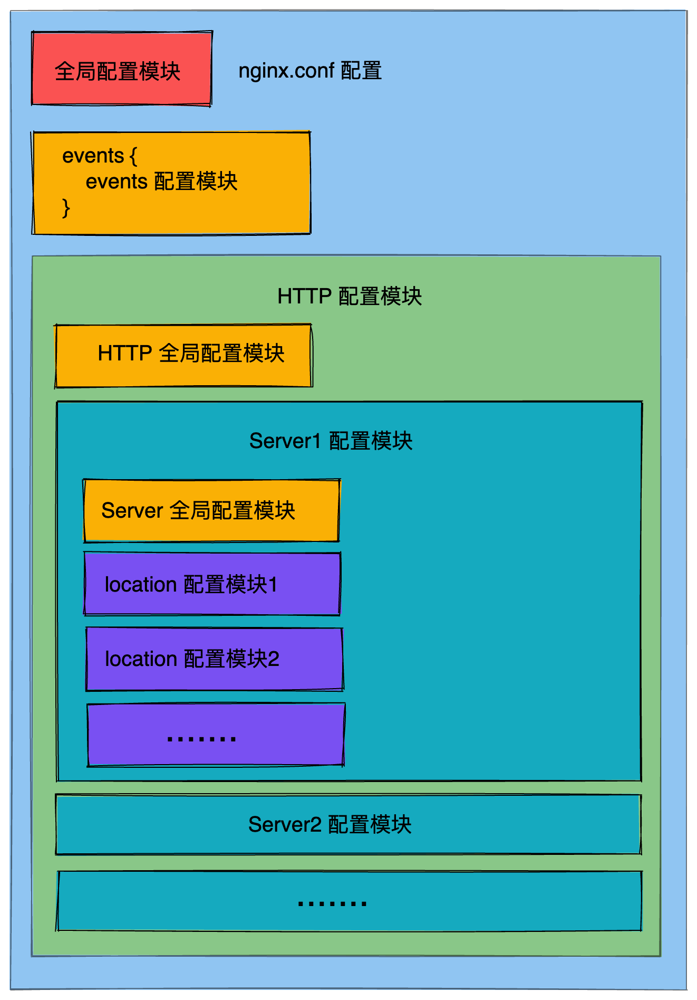
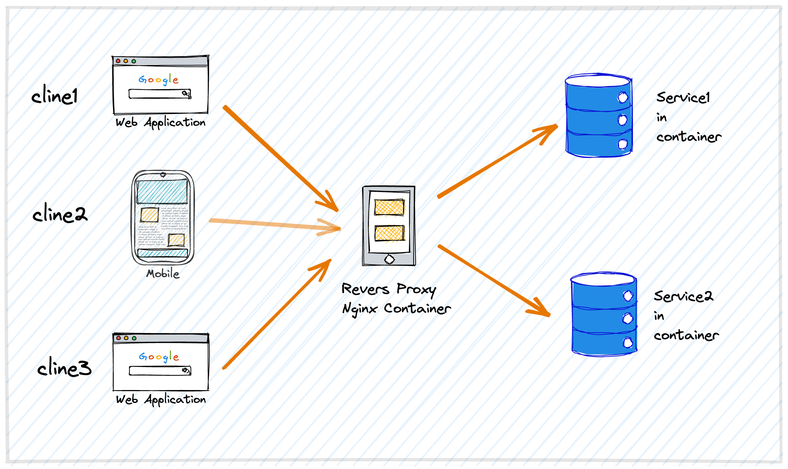
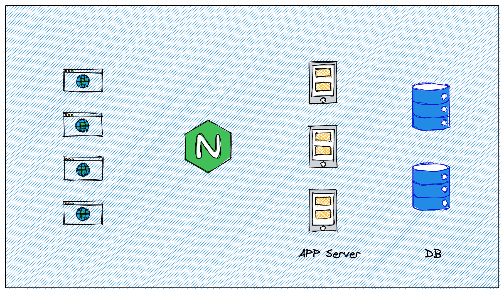
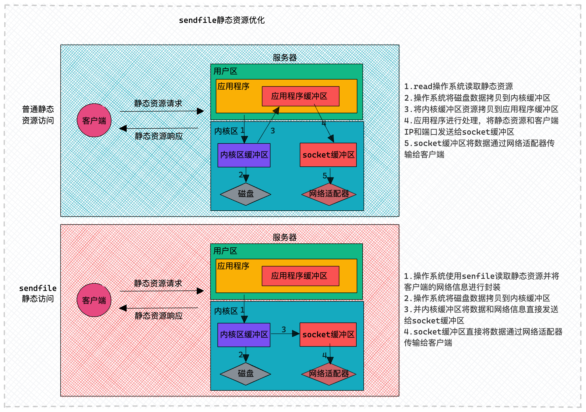

<script setup>
import Table from './table.vue';
</script>

# Nginx配置指南

<PageInfo/>

## nginx.conf配置

找到Nginx的安装目录下的```nginx.conf```文件，该文件负责Nginx的基础功能配置。

## 配置文件概述



## 配置文件示例

一个配置文件示例如下。

```bash
# 全局段配置
# ------------------------------

# 指定运行nginx的用户或用户组，默认为nobody。
#user administrator administrators;

# 设置工作进程数，通常设置为等于CPU核心数。
#worker_processes 2;

# 指定nginx进程的PID文件存放位置。
#pid /nginx/pid/nginx.pid;

# 指定错误日志的存放路径和日志级别。
error_log log/error.log debug;

# events段配置信息
# ------------------------------
events {
    # 设置网络连接序列化，用于防止多个进程同时接受到新连接的情况，这种情况称为"惊群"。
    accept_mutex on;

    # 设置一个进程是否可以同时接受多个新连接。
    multi_accept on;

    # 设置工作进程的最大连接数。
    worker_connections  1024;
}

# http配置段，用于配置HTTP服务器的参数。
# ------------------------------
http {
    # 包含文件扩展名与MIME类型的映射。
    include       mime.types;

    # 设置默认的MIME类型。
    default_type  application/octet-stream;

    # 定义日志格式。
    log_format myFormat '$remote_addr–$remote_user [$time_local] $request $status $body_bytes_sent $http_referer $http_user_agent $http_x_forwarded_for';

    # 指定访问日志的存放路径和使用的格式。
    access_log log/access.log myFormat;

    # 允许使用sendfile方式传输文件。
    sendfile on;

    # 限制每次调用sendfile传输的数据量。
    sendfile_max_chunk 100k;

    # 设置连接的保持时间。
    keepalive_timeout 65;

    # 定义一个上游服务器组。
    upstream mysvr {   
      server 127.0.0.1:7878;
      server 192.168.10.121:3333 backup;  #此服务器为备份服务器。
    }

    # 定义错误页面的重定向地址。
    error_page 404 https://www.baidu.com;

    # 定义一个虚拟主机。
    server {
        # 设置单个连接上的最大请求次数。
        keepalive_requests 120;

        # 设置监听的端口和地址。
        listen       4545;
        server_name  127.0.0.1;

        # 定义location块，用于匹配特定的请求URI。
        location  ~*^.+$ {
           # 设置请求的根目录。
           #root path;

           # 设置默认页面。
           #index vv.txt;

           # 将请求转发到上游服务器组。
           proxy_pass  http://mysvr;

           # 定义访问控制规则。
           deny 127.0.0.1;
           allow 172.18.5.54;          
        } 
    }
}
```

## location 路径映射详解

### 格式：

```bash
location [ = | ~ | ~* | !~ | !~* | ^~ | @ ] uri {...}
```

### 各标识解释：

* ```=```：精确匹配。如果匹配成功，立即停止搜索并处理此请求。
* ```~```：执行正则匹配，区分大小写。
* ```~*```：执行正则匹配，不区分大小写。
* ```!~```：正则匹配，区分大小写不匹配。
* ```!~*```：正则匹配，不区分大小写不匹配。
* ```^~```：前缀匹配。如果匹配成功，不再匹配其他```location```，且不查询正则表达式。
* ```@```：指定命名的```location```，主要用于内部重定向请求，如 ```error_page``` 和 ```try_files```。
* ```uri```：待匹配的请求字符串。可以是普通字符串或包含正则表达式。

### 优先级及示例

::: tip
优先级顺序：无特定标识 < ```^~``` < ```=``` < 正则匹配 (```~```, ```~*```, ```!~```, ```!~*```)
:::

示例：

```bash
location = / {
    # 精确匹配 /，主机名后面不能带任何字符串
    # http://abc.com [匹配成功]
    # http://abc.com/index [匹配失败]
}

location ^~ /img/ {
    # 以 /img/ 开头的请求，都会匹配上
    # http://abc.com/img/a.jpg [匹配成功]
    # http://abc.com/img/b.mp4 [匹配成功]
}

location ~* /Example/ {
    # 忽略 uri 部分的大小写
    # http://abc.com/test/Example/ [匹配成功]
    # http://abc.com/example/ [匹配成功]
}

location /documents {
    # 如果有正则表达式可以匹配，则优先匹配正则表达式
    # http://abc.com/documentsabc [匹配成功]
}

location / {
    # http://abc.com/abc [匹配成功]
}
```

## 反向代理

::: tip
反向代理是Nginx的核心功能之一，允许Nginx将来自客户端的请求转发到后端服务器，并将后端服务器的响应返回给客户端,使客户端感觉就像是直接与后端服务器通信一样。
:::



### 基本配置

要配置Nginx作为反向代理，您需要使用```location```块中的```proxy_pass```指令：

```bash
location /some/path/ {
    proxy_pass http://your_backend_address;
}
```

### 常用指令

* ```proxy_pass```：定义后端服务器的地址。
* ```proxy_set_header```：修改从客户端传递到代理服务器的请求头。
* ```proxy_hide_header```：隐藏从代理服务器返回的响应头。
* ```proxy_redirect```：修改从代理服务器返回的响应头中的```Location```和```Refresh```头字段。

### 示例配置

```bash
server {
    listen 80;
    server_name example.com;

    location / {
        proxy_pass http://localhost:8080;
        proxy_set_header Host $host;
        proxy_set_header X-Real-IP $remote_addr;
        proxy_set_header X-Forwarded-For $proxy_add_x_forwarded_for;
    }
}
```
在此配置中，所有发送到```example.com```的请求都会被代理到```localhost:8080```。

### 注意事项

1. 当使用```proxy_pass```指令时，确保后端服务器是可用的，否则Nginx将返回错误。
2. 使用```proxy_set_header```确保后端服务器接收到正确的请求头。
3. 如果后端服务器和Nginx在不同的机器上，确保网络连接是稳定的。

反向代理不仅可以提高网站的性能和可靠性，还可以用于负载均衡、缓存静态内容、维护和安全等多种用途。

## 负载均衡

::: tip
当有多台服务器时，代理服务器根据规则将请求分发到指定的服务器上处理。
:::


### 策略

### RR (round robin)

> 默认的负载均衡方法，按时间顺序逐一分配到不同的后端服务器

示例:

```bash
upstream web_servers { 
  server localhost:8081; 
  server localhost:8082; 
}
```

### 热备

> 当主服务器发生故障时，才将流量转发到备用服务器

示例:

```bash
upstream web_servers { 
  server 127.0.0.1:7878; 
  server 192.168.10.121:3333 backup; 
}
```

### 权重

> 根据预设权重分配请求，权重越高的服务器接收的请求越多

示例:

```bash
upstream web_servers { 
  server localhost:8081 weight=1; 
  server localhost:8082 weight=2; 
}
```

### ip_hash

> 根据客户端IP地址的hash结果分配请求，确保特定客户端IP的请求总是发给同一个后端服务器

示例:

```bash
upstream test { 
  ip_hash; 
  server localhost:8080;
  server localhost:8081; 
}
```
### fair (第三方)

> 根据后端服务器的响应时间分配请求，响应时间短的优先分配

示例:

```bash
upstream backend { 
  fair; 
  server localhost:8080; 
  server localhost:8081; 
}
```
### url_hash (第三方)

> 根据请求的URL的hash结果分配请求，确保同一个URL的请求总是发给同一个后端服务器

示例:

```bash
upstream backend { 
  hash_method crc32; 
  hash $request_uri; 
  server localhost:8080; 
  server localhost:8081; 
}
```

这些负载均衡策略可以根据实际应用场景和需求进行选择和组合使用。

## 配置动静分离

::: tip
动静分离是一种常见的Web服务器优化策略，主要是为了提高服务器的响应速度和减轻服务器的压力。在Nginx中，动静分离非常容易实现。
:::



### 动静分离的基本概念：

动静分离是指将动态内容和静态内容分开处理。静态内容通常包括：图片、CSS、JavaScript、HTML文件等，这些内容不需要经常更改。而动态内容则是经常变化的，如：PHP、ASP、JSP、Servlet等生成的内容。
### Nginx配置动静分离

1. 直接为静态内容设置一个别名或根目录：
```bash
location ~* .(jpg|jpeg|png|gif|ico|css|js)$ {
    root /path/to/static/files;
    expires 30d;  # 设置缓存时间
}
```

在上述配置中，所有的静态文件都被存放在```/path/to/static/files```目录下。```expires```指令设置了静态文件的缓存时间。

2. 使用alias别名：

如果你的静态文件不在项目的主目录下，你可以使用```alias```来指定静态文件的实际路径。
```bash
location /static/ {
    alias /path/to/static/files/;
}
```

在这个配置中，URL中的```/static/```会映射到文件系统的```/path/to/static/files/```。

3. 代理动态内容：

对于动态内容，你可能需要将请求代理到后端的应用服务器，如Tomcat、uWSGI等。

```bash
  location / {
    proxy_pass http://backend_server_address;
    proxy_set_header Host $host;
    proxy_set_header X-Real-IP $remote_addr;
}
```

### 注意事项：

* 确保你的静态文件路径配置正确，避免404错误。
* 使用```expires```指令为静态内容设置缓存，这可以减少服务器的负载并提高页面加载速度。
* 动静分离不仅可以提高服务器的响应速度，还可以减少后端服务器的压力，因为静态文件通常由Nginx直接处理，而不需要代理到后端服务器。

## 静态资源优化

为了提高静态资源的传输效率，Nginx提供了以下三个主要的优化指令：

* ```sendfile```
* ```tcp_nopush```
* ```tcp_nodelay```

### sendfile 指令

```sendfile``` 用于开启高效的文件传输模式。它通过调用系统内核的 ```sendfile``` 函数来实现，从而避免了文件的多次拷贝，同时减少了用户态和内核态之间的切换，从而提高了静态文件的传输效率。
### 传统的静态资源请求过程：

1. 客户端通过网络接口向服务端发送请求。
2. 操作系统将这些请求传递给服务器端应用程序。
3. 服务器应用程序处理请求。
4. 处理完成后，操作系统将处理得到的结果通过网络适配器传递给客户端。

### tcp_nopush 和 tcp_nodelay指令

#### tcp_nopush

当 ```sendfile``` 开启时，```tcp_nopush``` 也可以被启用。它的主要目的是提高网络数据包的传输效率。

#### tcp_nodelay

只有在 ```keep-alive``` 连接开启时，```tcp_nodelay``` 才能生效。它的目的是提高网络数据包的实时性。

```tcp_nopush``` 的工作原理是设置一个缓冲区，当缓冲区满时才进行数据发送，这样可以大大减少网络开销。

## 静态资源压缩

在数据的传输过程中，为了进一步优化，Nginx引入了gzip模块，用于对传输的资源进行压缩，从而减少数据的传输体积，提高传输效率。

Nginx中的静态资源压缩可以在http块、server块、location块中配置。涉及的主要模块有：

* ```ngx_http_gzip_module模块```(内置)
* ```ngx_http_gzip_static_module模块```
* ```ngx_http_gunzip_module模块```

### Gzip模块配置指令


1. ```gzip```：开启或关闭gzip功能。

* 语法：```gzip on | off```
* 默认值：```gzip off```
* 配置位置：http块，server块，location块


2. ```gzip_types```：根据响应的MIME类型选择性地开启gzip压缩。

* 语法：```gzip_types mime-type```
* 默认值：```gzip_types text/html```
* 配置位置：http块，server块，location块
* 示例：```gzip_types application/javascript```


3. ```gzip_comp_level```：设置Gzip压缩的程度，级别从1-9。

* 语法：```gzip_comp_level level```
* 默认值：```gzip_comp_level 1```
* 配置位置：http块，server块，location块


4. ```gzip_vary```：设置是否携带"Vary:Accept-Encoding"的响应头部。

* 语法：```gzip_vary on|off```
* 默认值：```gzip_vary off```
* 配置位置：http块，server块，location块


5. ```gzip_buffers```：处理请求压缩的缓冲区数量和大小。

* 语法：```gzip buffers number size```
* 默认值：```gzip_buffer 32 4k | 16 8K```
* 配置位置：http块，server块，location块


6. ```gzip_disable```：选择性地开启和关闭gzip功能，基于客户端的浏览器标志。

* 语法：```gzip_disable regex```
* 默认值：```gzip_disable -```
* 配置位置：http块，server块，location块
* 示例：```gzip_disable "MSIE [1-6]."```


7. ```gzip_http_version```：针对不同的http协议版本，选择性地开启和关闭gzip功能。

* 语法：```gzip_http_version 1.0 | 1.1```
* 默认值：```gzip_http_version 1.1```
* 配置位置：http块，server块，location块


8. ```gzip_min_length```：根据响应内容的大小决定是否使用gzip功能。

* 语法：```gzip_min_length length```
* 默认值：```gzip_min_length 20```
* 配置位置：http块，server块, location块


9. ```gzip_proxied```：设置是否对nginx服务器对后台服务器返回的结果进行gzip压缩。

* 语法：```gzip_proxied off | expired | no-cache | no-store | private | no_last_modified | no_etag | auth | any```
* 默认值：```gzip_proxied off```
* 配置位置：http块，server块, location块

### Gzip与sendfile共存问题

Gzip在应用程序中进行压缩，而sendfile可以直接通过系统的网络设备发送静态资源文件，绕过应用程序的用户进程。为了解决这两者之间的冲突，Nginx提供了```ngx_http_gzip_static_module```模块的```gzip_static```指令。

1. ```gzip_static```：对静态文件进行提前压缩。
* 语法：```gzip_static on|off|always```
* 默认值：```gzip_static off```
* 配置位置：http块，server块, location块

通过上述配置，Nginx可以有效地对静态资源进行压缩，提高数据传输效率，同时与sendfile功能共存，确保高效的资源传输。

## 跨域

跨域资源共享（CORS）是一种安全策略，用于控制哪些网站可以访问您的资源。当您的前端应用程序和后端API位于不同的域上时，通常会遇到跨域问题。Nginx可以通过设置响应头来帮助解决这个问题。

```bash
location / {
    # 其他配置...

    # 设置允许来自所有域名请求。如果需要指定域名，将'*'替换为您的域名。
    add_header 'Access-Control-Allow-Origin' '*';

    # 允许的请求方法。
    add_header 'Access-Control-Allow-Methods' 'GET, POST, OPTIONS';

    # 允许的请求头。
    add_header 'Access-Control-Allow-Headers' 'DNT,User-Agent,X-Requested-With,If-Modified-Since,Cache-Control,Content-Type,Range';

    # 允许浏览器缓存预检请求的结果，单位为秒。
    add_header 'Access-Control-Max-Age' 1728000;

    # 允许浏览器在实际请求中携带用户凭证。
    add_header 'Access-Control-Allow-Credentials' 'true';

    # 设置响应类型为JSON。
    add_header 'Content-Type' 'application/json charset=UTF-8';

    # 针对OPTIONS请求单独处理，因为预检请求使用OPTIONS方法。
    if ($request_method = 'OPTIONS') {
        return 204;
    }
}
```
::: tip
注意：在生产环境中，出于安全考虑，建议不要使用 ```'Access-Control-Allow-Origin' '*'```，而是指定确切的域名。
:::

## 防盗链

::: tip
防盗链是指防止其他网站直接链接到你的网站资源（如图片、视频等），从而消耗你的服务器带宽。Nginx提供了一个非常方便的模块——```ngx_http_referer_module```，用于实现防盗链功能。
:::

### 基本的防盗链配置：

```bash
location ~ .*.(gif|jpg|jpeg|png|bmp|swf)$ {
    valid_referers none blocked www.example.com example.com *.example.net;
    
    if ($invalid_referer) {
        return 403;
    }
}
```

在上述配置中：

* ```valid_referers```定义了合法的来源页面。```none```表示直接访问，```blocked```表示没有```Referer```头的访问，```www.example.com```和```example.com```是合法的来源域名，```*.example.net```表示```example.net```的所有子域名都是合法的来源。

* ```$invalid_referer```变量会在来源不在```valid_referers```列表中时变为"true"。

* 如果来源不合法，服务器将返回403禁止访问的状态码。

### 使用错误图片代替原图片：

如果你不想显示403错误，而是想显示一个错误图片（例如：“禁止外链”的图片），你可以这样配置：

```bash
location ~ .*.(gif|jpg|jpeg|png|bmp|swf)$ {
    valid_referers none blocked www.example.com example.com *.example.net;
    
    if ($invalid_referer) {
        rewrite ^/.*$ /path/to/error/image.jpg;
    }
}
```

在上述配置中，当检测到盗链时，Nginx会重写请求的URL，将其指向一个错误图片。

### 注意事项：

* 防盗链配置可能会影响搜索引擎的爬虫，因此在实施防盗链策略时要小心。

* 如果你的网站使用了CDN，确保CDN的服务器也在```valid_referers```列表中，否则CDN可能无法正常工作。

* 为了确保防盗链配置正确，你应该在生产环境之前在测试环境中进行充分的测试。

### 内置变量

nginx的配置文件中可以使用的内置变量以美元符$开始。其中，大部分预定义的变量的值由客户端发送携带。

<Table/>

这些内置变量为nginx配置提供了极大的灵活性，使得nginx能够根据请求的各种属性进行决策和处理。

## Contributors

<Contributors/>

<CopyRight/>