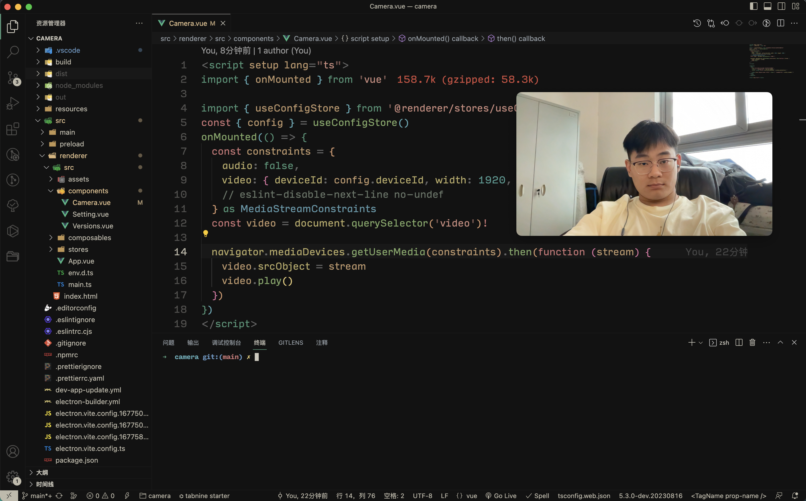
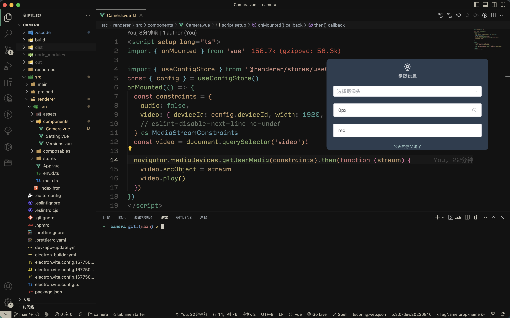

# 摄像头

基于 Electron+Vue3+Vite 开发的桌面摄像头软件，方便直播、短视频拍摄等场景。

<CustomLink title="摄像头地址源码" href="https://github.com/Virkano/camera" />

(自己打包生成就好了，有问题提bug)

## 功能特点

* 支持摄像头切换
* 摄像头窗口置顶
* 配置边框宽度
* 定义边框颜色
* 支持圆角与横屏显示
* Window、Mac 多系统支持
* 支持窗口全屏
* 可以开启多个摄像头
* 摄像头镜像操作

## 效果展示

摄像头角效果

支持多种参数的配置

支持横屏样式

支持多摄像头选择