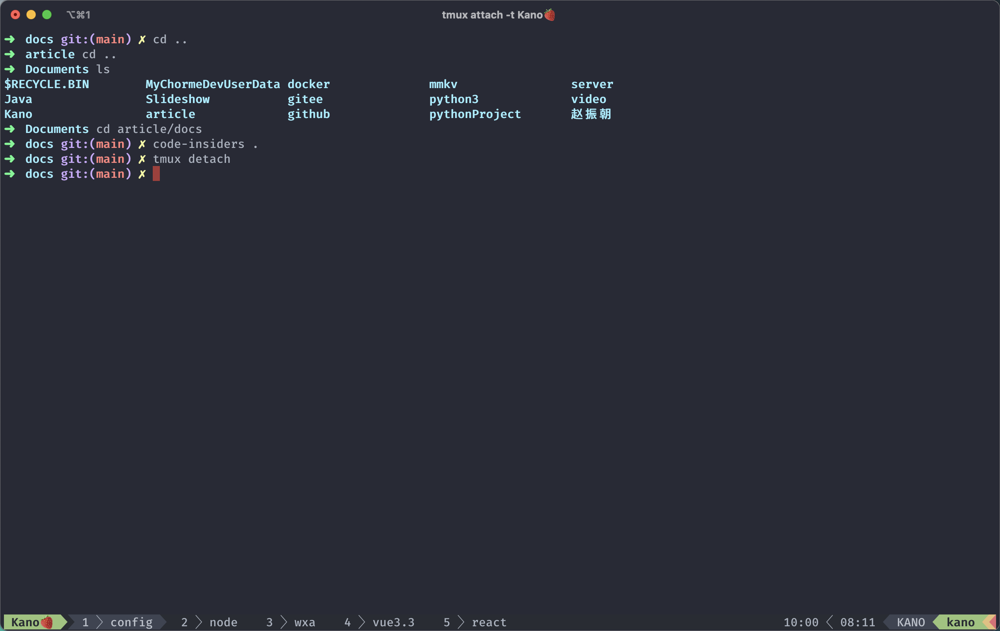
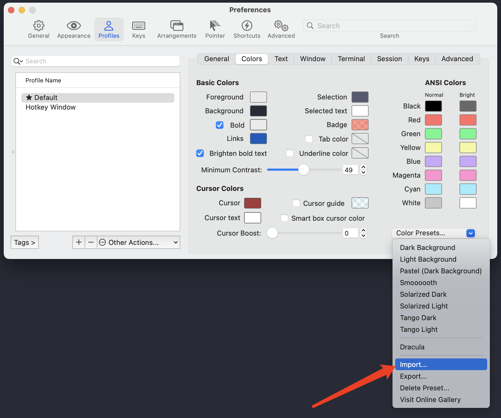

# iterm2

<PageInfo/>

```Iterm2``` 是苹果系统增加的命令行工具，定制化很强使用方便，并且外观也好看。

## 安装

直接从官网下载安装即可：

<CustomLink title="官网地址" href="https://iterm2.com/"/>

<CustomLink title="官网风格地址" href="https://iterm2colorschemes.com/"/>

或者你可以直接使用 Homebrew 进行安装：

```bash
brew cask install iterm2
```

## 风格设定

我们可以定制非常漂亮的 iterm 风格，下面是作者在使用的风格

<CustomLink title="Dracula" href="https://draculatheme.com/iterm"/>



解包后在 iterm 软件包中导入风格包 快捷键 👉 ```command + ,```




## Contributors

<Contributors/>

<CopyRight/>