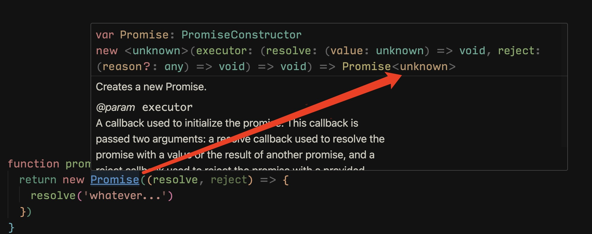
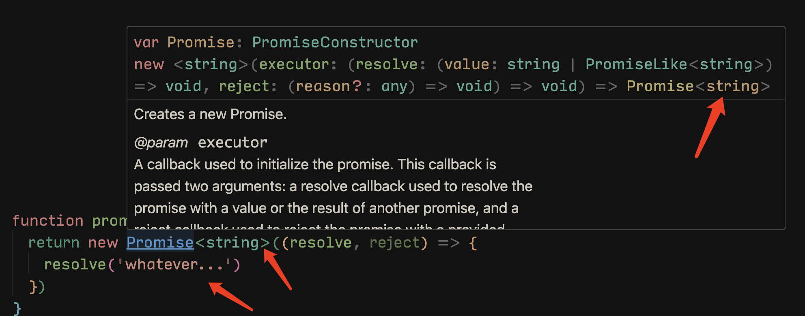

# 内置对象

<PageInfo/>

JavaScript 中有很多内置对象，它们可以直接在 TypeScript 中当做定义好了的类型。

内置对象是指根据标准在全局作用域（Global）上存在的对象。这里的标准是指 ECMAScript 和其他环境（比如 DOM）的标准。

## ECMAScript 的内置对象

ECMAScript 标准提供的内置对象有：

```Boolean```、```Number```、```String```、```Error```、```Date```、```RegExp``` 等。

我们可以在 TypeScript 中将变量定义为这些类型：

```typescript
let b: Boolean = new Boolean(1);
let n: Number = new Number(true)
let s: String = new String('啦啦啦，帅哥你来了🤵')
let e: Error = new Error('Error occurred');
let d: Date = new Date();
let r: RegExp = /[a-z]/;
```

更多的内置对象，可以<CustomLink title="查看 MDN 的文档" href="https://developer.mozilla.org/en-US/docs/Web/JavaScript/Reference/Global_Objects" />


而他们的定义文件，则在 <CustomLink title="TypeScript 核心库的定义文件" href="https://github.com/Microsoft/TypeScript/tree/main/src/lib"/> 中。

## DOM 和 BOM 的内置对象

DOM 和 BOM 提供的内置对象有：

```Document```、```HTMLElement```、```Event```、```NodeList``` 等。

TypeScript 中会经常用到这些类型：

```typescript
let body: HTMLElement = document.body;
let allDiv: NodeList = document.querySelectorAll('div');
document.addEventListener('click', function(e: MouseEvent) {
  // Do something
});
//dom元素的映射表
interface HTMLElementTagNameMap {
    "a": HTMLAnchorElement;
    "abbr": HTMLElement;
    "address": HTMLElement;
    "applet": HTMLAppletElement;
    "area": HTMLAreaElement;
    "article": HTMLElement;
    "aside": HTMLElement;
    "audio": HTMLAudioElement;
    "b": HTMLElement;
    "base": HTMLBaseElement;
    "bdi": HTMLElement;
    "bdo": HTMLElement;
    "blockquote": HTMLQuoteElement;
    "body": HTMLBodyElement;
    "br": HTMLBRElement;
    "button": HTMLButtonElement;
    "canvas": HTMLCanvasElement;
    "caption": HTMLTableCaptionElement;
    "cite": HTMLElement;
    "code": HTMLElement;
    "col": HTMLTableColElement;
    "colgroup": HTMLTableColElement;
    "data": HTMLDataElement;
    "datalist": HTMLDataListElement;
    "dd": HTMLElement;
    "del": HTMLModElement;
    "details": HTMLDetailsElement;
    "dfn": HTMLElement;
    "dialog": HTMLDialogElement;
    "dir": HTMLDirectoryElement;
    "div": HTMLDivElement;
    "dl": HTMLDListElement;
    "dt": HTMLElement;
    "em": HTMLElement;
    "embed": HTMLEmbedElement;
    "fieldset": HTMLFieldSetElement;
    "figcaption": HTMLElement;
    "figure": HTMLElement;
    "font": HTMLFontElement;
    "footer": HTMLElement;
    "form": HTMLFormElement;
    "frame": HTMLFrameElement;
    "frameset": HTMLFrameSetElement;
    "h1": HTMLHeadingElement;
    "h2": HTMLHeadingElement;
    "h3": HTMLHeadingElement;
    "h4": HTMLHeadingElement;
    "h5": HTMLHeadingElement;
    "h6": HTMLHeadingElement;
    "head": HTMLHeadElement;
    "header": HTMLElement;
    "hgroup": HTMLElement;
    "hr": HTMLHRElement;
    "html": HTMLHtmlElement;
    "i": HTMLElement;
    "iframe": HTMLIFrameElement;
    "img": HTMLImageElement;
    "input": HTMLInputElement;
    "ins": HTMLModElement;
    "kbd": HTMLElement;
    "label": HTMLLabelElement;
    "legend": HTMLLegendElement;
    "li": HTMLLIElement;
    "link": HTMLLinkElement;
    "main": HTMLElement;
    "map": HTMLMapElement;
    "mark": HTMLElement;
    "marquee": HTMLMarqueeElement;
    "menu": HTMLMenuElement;
    "meta": HTMLMetaElement;
    "meter": HTMLMeterElement;
    "nav": HTMLElement;
    "noscript": HTMLElement;
    "object": HTMLObjectElement;
    "ol": HTMLOListElement;
    "optgroup": HTMLOptGroupElement;
    "option": HTMLOptionElement;
    "output": HTMLOutputElement;
    "p": HTMLParagraphElement;
    "param": HTMLParamElement;
    "picture": HTMLPictureElement;
    "pre": HTMLPreElement;
    "progress": HTMLProgressElement;
    "q": HTMLQuoteElement;
    "rp": HTMLElement;
    "rt": HTMLElement;
    "ruby": HTMLElement;
    "s": HTMLElement;
    "samp": HTMLElement;
    "script": HTMLScriptElement;
    "section": HTMLElement;
    "select": HTMLSelectElement;
    "slot": HTMLSlotElement;
    "small": HTMLElement;
    "source": HTMLSourceElement;
    "span": HTMLSpanElement;
    "strong": HTMLElement;
    "style": HTMLStyleElement;
    "sub": HTMLElement;
    "summary": HTMLElement;
    "sup": HTMLElement;
    "table": HTMLTableElement;
    "tbody": HTMLTableSectionElement;
    "td": HTMLTableDataCellElement;
    "template": HTMLTemplateElement;
    "textarea": HTMLTextAreaElement;
    "tfoot": HTMLTableSectionElement;
    "th": HTMLTableHeaderCellElement;
    "thead": HTMLTableSectionElement;
    "time": HTMLTimeElement;
    "title": HTMLTitleElement;
    "tr": HTMLTableRowElement;
    "track": HTMLTrackElement;
    "u": HTMLElement;
    "ul": HTMLUListElement;
    "var": HTMLElement;
    "video": HTMLVideoElement;
    "wbr": HTMLElement;
}
```

它们的定义文件同样在 TypeScript 核心库的定义文件中。

## 定义Promise

如果我们不指定返回的类型TS是推断不出来返回的是什么类型



指定返回的类型



函数定义返回promise 语法规则:Promise\<T> 类型 

```typescript
function promise():Promise<string>{
  return new Promise<string>((resolve, reject) => {
    return resolve('whatever')
  });
}
```

## TypeScript 核心库的定义文件

TypeScript 核心库的定义文件中定义了所有浏览器环境需要用到的类型，并且是预置在 TypeScript 中的。

当你在使用一些常用的方法的时候，TypeScript 实际上已经帮你做了很多类型判断的工作了，比如：
```typescript
Math.pow(10, '2');

// index.ts(1,14): error TS2345: Argument of type 'string' is not assignable to parameter of type 'number'.
```

上面的例子中，```Math.pow``` 必须接受两个 ```number``` 类型的参数。事实上 ```Math.pow``` 的类型定义如下：
```typescript
interface Math {
    /**
     * Returns the value of a base expression taken to a specified power.
     * @param x The base value of the expression.
     * @param y The exponent value of the expression.
     */
    pow(x: number, y: number): number;
}
```

再举一个 DOM 中的例子：

```typescript
document.addEventListener('click', function(e) {
    console.log(e.targetCurrent);
});

// index.ts(2,17): error TS2339: Property 'targetCurrent' does not exist on type 'MouseEvent'.
```

上面的例子中，```addEventListener``` 方法是在 TypeScript 核心库中定义的：

```typescript
interface Document extends Node, GlobalEventHandlers, NodeSelector, DocumentEvent {
    addEventListener(type: string, listener: (ev: MouseEvent) => any, useCapture?: boolean): void;
}
```

所以 ```e``` 被推断成了 ```MouseEvent```，而 ```MouseEvent``` 是没有 ```targetCurrent``` 属性的，所以报错了。

注意，TypeScript 核心库的定义中不包含 Node.js 部分。

## 用 TypeScript 写 Node.js

Node.js 不是内置对象的一部分，如果想用 TypeScript 写 Node.js，则需要引入第三方声明文件：

```bash
npm install @types/node --save-dev
```


## Contributors

<Contributors/>

<CopyRight/>

<Person/>