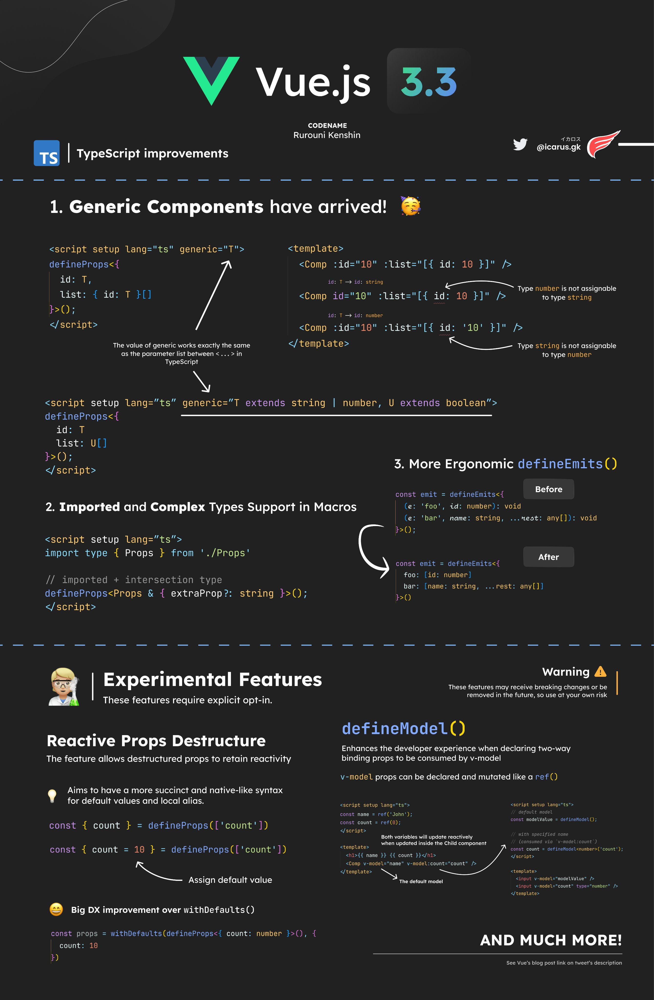

# 你不知道的defineModel

<PageInfo/>

相信大伙都已经收到```Vue3.3```最新版的风了吧，新版本的更新中优化了不少此前在Vue3中比较“麻烦”的使用方法，下面是更新的简介图 👇



## DefineModel核心

> defineModel 这是一个语法糖，目前需要手动开启，否则无法识别。
```js{8,9}
import { defineConfig } from 'vite'
import vue from '@vitejs/plugin-vue'

// https://vitejs.dev/config/
export default defineConfig({
  plugins: [vue({
    script: {
      defineModel: true,
      propsDestructure: true // 解构 props
    }
  })],
})
```

### 新旧对比

<!-- 在开发的过程中，如果有需要通过<b>子组件进行状态更新</b>的话，<b>v-model</b>是一个绕不开的点。以前的<b>v-model</b>是这样用的 👇 -->

以前组件想要支持 v-model，需要两个步骤：

* <b>声明 props</b>
* 在打算更新 props 时，<b>emit</b> ```update:propName``` <b>事件</b>

子组件支持 ```v-model``` 的写法：
```vue
<!-- BEFORE  -->
<script setup>
const props = defineProps(['modelValue'])
const emit = defineEmits(['update:modelValue'])
console.log(props.modelValue)

function onInput(e) {
  emit('update:modelValue', e.target.value)
}
</script>

<template>
  <input :value="modelValue" @input="onInput" />
</template>
```

父组件：
```vue
<script setup>
import { ref } from 'vue'
import Comp from './Comp.vue'

const msg = ref('')
</script>
<template>
  <Comp v-model="msg">
</template>
```

Vue 3.3 用新的 ```defineModel``` 宏简化了用法。<b>宏将自动注册 props 和事件</b> ，并返回一个 ref：
```vue
<!-- AFTER -->
<script setup>
const modelValue = defineModel()
console.log(modelValue.value)
</script>

<template>
  <input v-model="modelValue" />
</template>
```

根据接受 ```defineModel``` 返回值的变量名，这里是 ```modelValue```，会自动定义 props 名为 
 ```modelValue```，emit 事件为 ```update:modelValue```

也支持<b>显示传入 props 名称</b>

```js
const count = defineModel<number>('count', { default: 0 })
```

此功能是实验性的，需要<b>明确的选择加入</b>。

<CustomLink title="详情:RFC#503-[Core Team RFC] New SFC macro: defineModel #503" href="https://github.com/vuejs/rfcs/discussions/503" />

<CustomLink title="原文地址:Today we're excited to announce the release of Vue 3.3 'Rurouni Kenshin'" href="https://blog.vuejs.org/posts/vue-3-3" />

相信看完上面的案例之后大伙就已经有一个大概的猜想了：

```DefineModel``` 其实为组件实例注册了 ```update:modelValue``` 事件，并且在 ```props``` 的```setter``` 中又调用了 ```update:modelValue``` 事件，从而实现的 ```v-model``` 语法糖

上面的猜测又包含了两个问题：
> 1. ```defineModel``` 是如何注册 ```update:modelValue``` 事件的
> 2. 如何在 ```defineModel``` 变量修改时发布 ```update:modelValue``` 事件的

## Contributors

<Contributors/>

<CopyRight/>